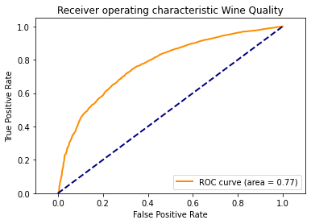
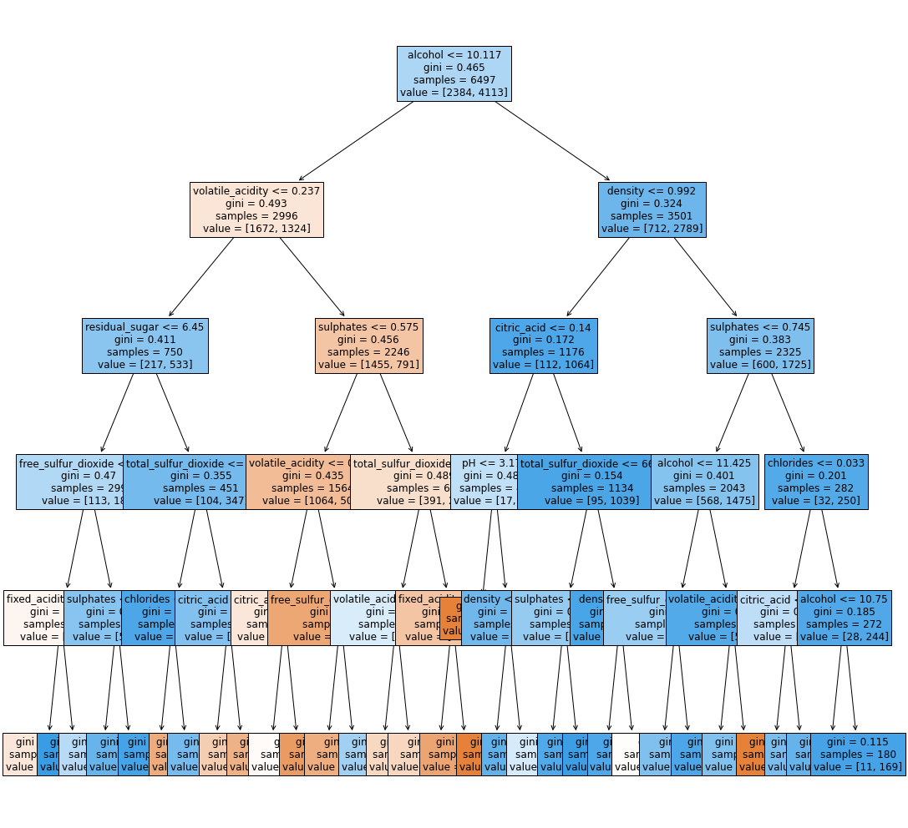

# .


## Final Report - Shawn Cicoria (sc2443@njit.edu)
## CS 634 Data Mining
### May 2, 2020


# 1 - Introduction
For this project both Support Vector Machines and Decision Tree are used to evaluate an existing data set - well known as the "Wine Dataset" for the primary goal:

> to be able to predict a "good wine" based upon its physical and chemical properties.

This project report is accompanied by the following:

- Project file report - PDF form (this file)
- Within the `notebooks` folder all the accompanying Jupyter IPython Notebooks which correspond to each section of the report, namely:
  -  3.1 - Data EDA.ipynb
  -  3.2 DT Model Generation.ipynb
  -  3.2 SVM Model Generation.ipynb
- Corresponding Python scripts for each of the above notebooks
  -  3.1 - Data EDA.py
  -  3.2 DT Model Generation.py
  -  3.2 SVM Model Generation.py
- Supporting python functions used within Notebooks and above scripts
  - utils\helpers.py
- Data files
  - winequality-[red|white].csv
- Root folder
  - pyproject.toml - this is the dependency file used by Poetry to build the virtual environment. You can utilize this or use `pip3` under Python 3.7+ to install dependencies and run the scripts directly or load the Jupyter notebooks.
  - poetry.lock - this is the lock file that sets the full dependency of all python libraries. This is used by Poetry; if utilizing `pip3` this is not used.

  
## 1.1 Running the code.

A video recording of the code running from the command line Python interpreter is located here: [https://scicorianjit.blob.core.windows.net/njit/shawn_cicoria_finaltermproj.mp4](https://scicorianjit.blob.core.windows.net/njit/shawn_cicoria_finaltermproj.mp4)


Once you have Python 3.7+ along with all the dependencies installed, you can run each of the scripts from the command line:

```
cd notebooks/
python3 "3.1 - Data EDA.py"
python3 "3.2 DT Model Generation.py"
python3 "3.2 SVM Model Generation.py"

```

The scripts can also be run from within Visual Studio Code which provides a really nice environment for viewing and running. Ensure that you install both Visual Studio Code along with the Python Extension - and of course an installation of Python 3.7+

- Visual Studio Code - https://code.visualstudio.com/
- Python Extension https://marketplace.visualstudio.com/items?itemName=ms-python.python
- Python - https://www.python.org/

These notebooks can be uploaded to [Google Colab](https://colab.research.google.com/) and run from there as well - just be sure to upload the folder `./utils` to the root of the notebook session. The beginning part of each notebook downloads the needed data files. 


## 1.2 All contents of submission

All contents as a ZIP file are downloadable at: [shawn_cicoria_finaltermproj.zip](https://scicorianjit.blob.core.windows.net/njit/shawn_cicoria_finaltermproj.zip) 


> NOTE: In speaking with the Instructor -- **Yasser Abduallah** -- that given the thin, essentially lack of Python implementation of **C4.5** or **ID3** that instead the **CART** algorithm would be used. 

# 2 - Methodology and Approach

For this project we are using two non-parametric classifiers to analyze and learn from the data. Both Support Vector Machines and Decision Trees adapt to the data and learn the features or parameters as it evolves in training. This is contrasted to other models, such as Linear or Logistic that have a set number of parameters before the training begins.

While we look at each of the features in the Wine data set as "parameters", from the non-parametric perspective, they are not fixed, but learned from the data, thus is sticks to the data. This can cause over-fitting with lots of data or features. In Decision Tree analysis, for example, we would limit the number of "decisions" or levels as going through each and every possible outcome can cause over-fitting to the training data.


## 2.1 - Classification

Classification uses the data to determine for each of the observations what class or outcome it might or should be. The classes or labels can often be binary (just two possible outcomes) or multi-class where there are more than 2 possible outcomes.  As examples of binary - Male or Female; Rain or No-Rain, etc.

In this report we are using a data set that starts with a **quality** class that ranks wine from 0-9, with 9 being the highest quality, and 0 the lowest. The ranking is done by humans thus subjective to each of the taste testers abilities. However, for this analysis, the data is converted to a binary outcome, which is explained later, but intended to simplify the prediction of if the wine is **good** or **not-good**.  The reasons for this is simplification, reduce training time, and as seen with the data, the quality label itself is not a great distribution (normal) and has groupings of data itself clustered in a low range and a high range. The transformation of the data is discussed later. 

## 2.2 - Support Vector Machine
This report uses an implementation of Support Vector Machines (SVM) from [Scikit learn](https://scikit-learn.org/stable/modules/svm.html). This is a well used and one of the most popular Python frameworks for Data Mining, Machine Learning, Statistical processing. It is kept up-to-date and aligns with latest versions of Python including Python 3.8.

### 2.2.1 - Linear vs non-Linear Data
In using Support Vector Machines with a linear classified the data must be linear separable. That means each of the feature to feature mappings must present the actual class that is clearly separated by a linear plane. While SVM with Radial Bias Function (RBF) can accommodate non-linear data we will look towards taking our Data and modifying it for easier analysis.

In this report, RBF is used, as shown later due to the non-linear separability of the data. RBF is also explained in greater detail in that section.

## 2.3 - Decision Tree
Along with SVM, a Decision Tree study is also done.  

Initially the goal was to use the [C4.5](https://en.wikipedia.org/wiki/C4.5_algorithm) or even  [ID3](https://en.wikipedia.org/wiki/ID3_algorithm) which are both relatively well known from [Ross Quinlan](https://en.wikipedia.org/wiki/Ross_Quinlan) and date back to 1995 and 1965 respectively. While the author of those two algorithms has created new versions, such as C5.0, but they have been commercialized. Additionally, the C4.5 algorithm has been well implemented in [Weka as J48](https://en.wikipedia.org/wiki/Weka_(machine_learning)).

Unfortunately, while there are many attempted efforts in Open Source for a Python version of C4.5 or ID3, of all the modules researched none were found to be stable enough for use in this report. Many were just simple steps of the algorithm, not a library for re-use.

> NOTE: In speaking with the Instructor -- **Yasser Abduallah** -- that given the thin, essentially lack of Python implementation of **C4.5** or **ID3** that instead the **CART** algorithm would be used. 

### 2.3.1 - CART Decision Tree
The Classification and Regression Trees (CART) algorithm is implemented in [Scikit](https://scikit-learn.org/stable/modules/tree.html) learn as the only Decision Tree algorithm. CART can work with features that are either continuous or categorical. Where as C4.5 and ID3 both require categorical features. C4.5 can handle continuous features, but underneath it creates bins or thresholds -- essentially categories to accommodate.

The CART implementation can work with both binary or multi-class output as well. For features it uses Regression and minimization of mean squared error (MSE) and mean absolute error (MAE).  For Categorical features uses base classification with either **entropy** or **gini** for the impurity measures among the features for each decision tree node.  The term **gini** is named for the statistician [Corrado Gini](https://en.wikipedia.org/wiki/Corrado_Gini) that devised the measure for gauging economic inequality.

At splitting time, information gain is used based upon the outcome of the Regression or the Classification impurity results for the features.

### 2.3.2 - Python ID3/C4.5 Implementations Reviewed and Rejected

Below are some of the Python code bases I took a look at for a stable ID3 or C4.5 implementation. As stated before, most didn't essentially work and root cause of failure varied from changes in underlying dependencies, bad algorithms in that it only worked with the supplied test data and not general data, some still required Python 2.7 which for this report Python 3.7+ is used, and some even had hard coding.

* Source code "almost" works but have bugs remaining that have not figured out yet; not very robust: [Tree algorithms: ID3, C4.5, C5.0 and CART - Data Driven Investor - Medium](https://medium.com/datadriveninvestor/tree-algorithms-id3-c4-5-c5-0-and-cart-413387342164)
* ChefBoost - has bugs now, can't predict and intermittent issues with Rules are invalid Python (this emits a Rules.;py file --- I have it almost working when I reclassified as categories vs. continious. It defaults to Regression if the features are numerical. [chefboost/chefboost at master · serengil/chefboost](https://github.com/serengil/chefboost/tree/master/chefboost)
  * [serengil/chefboost: Lightweight Decision Trees Framework supporting Gradient Boosting (GBDT, GBRT, GBM), Random Forest and Adaboost w/categorical features support for Python](https://github.com/serengil/chefboost)
* Poorly written and Python 2.7 - [ryanmadden/decision-tree: C4.5 Decision Tree python implementation with validation, pruning, and attribute multi-splitting](https://github.com/ryanmadden/decision-tree)
* Bugs and written for Python 2.7 - [NFG: barisesmer/C4.5: A python implementation of C4.5 algorithm by R. Quinlan](https://github.com/barisesmer/C4.5)


#### 3.3.2.1 - Experimentation Notebooks

For completeness, the Jupyter notebooks used in the evaluation and experimentation with these libraries is packed along with the rest of the project in the archive file.

# 3 - Analysis and Modeling
First a discussion of the data utilized for this report. The data set is provided in two different `csv` files. 

The source of the file is from [UC Irvine Machine Learning Repository - Wine Quality Data Set](https://archive.ics.uci.edu/ml/datasets/wine+quality).

The two files and the full description are contained in **Appendix A** but the relevant parts needed for this initial EDA are detailed below.

Note that the **output** variable of **quality** is based upon **sensor** data. That means a human has interpreted the Wine and classified the level of quality. Soon we will see those levels of quality - or the **labels** that each wine can be assigned based upon that human classification.

The details of the files again are:
- two data files - red wine, white wine
- number of instances (records/observations) - red wine - 1599; white wine - 4898. 
- number of Attributes: 11 + output attribute
- attribute information
    - Input variables (based on physicochemical tests):
       - fixed acidity
       - volatile acidity
       - citric acid
       - residual sugar
       - chlorides
       - free sulfur dioxide
       - total sulfur dioxide
       - density
       - pH
       - sulphates (UK Eng) - sulfates
       - alcohol
   - Output variable (based on sensory data): 
       - quality (score between 0 and 10)

 - missing attribute values: **None


## 3.1 - Data Exploratory Data Analysis (EDA)
Prior to jumping into modeling and running the algorithms, it is best to get a handle on the data. EDA is generally is visualizing, running statistics to understand the various features, data types within each feature and even between features and labels.

For this there are few areas that I'll document here that impacted the EDA and modeling. For each of the concerns, the sections that follow discuss some of the decisions made and approach for prepping the data for final modeling.
- 3.1.1 - multi-class vs. binary classification and
    - feature and label correlation
- 3.1.2 - normalization and scaling feature data
- 3.1.3 - linear separability of data


Support Vector Machines are sensitive to data (features) that have not been scaled consistently and without customized kernels such as Radial Bias Function (RBF) cannot converge with non-linear data.  Decision Trees are not sensitive to feature scaling differences. In addition, Decision Trees are non-linear classifiers and have no sensitivity to the linear separability of the data. For the scaling and standardization needs you may decide to scale or normalize the data for visualization needs but the underlying algorithm relies on value in the Entropy calculations that results in values between `0 and 1`, along with the information gain based upon conditional probabilities that is also positive.


```python
# First lets pull and load up Pandas data frames as follows:
# df_red - just the red wine
# df_white - just the white wine
# df_all -- both red and white in the same data frame.

# NOTE: if the file already exists, we skip the downoad from an internet
#       location. The force flag allows overriding that behavior.

from utils.helpers import *
df_red, df_white, df_all = pull_and_load_data(force = False)
```


### 3.1.1 - Class Analysis - multi-class vs. binary classification
For this analysis I only use the combined dataset of red and white wine. You will see shortly as to why this may not matter **much** - I emphasize that this is something for further analysis in the future. However, my own experimentation showed little impact of the difference between white or red with only a few points difference in accuracy of the model. So, in short, you'll see the `df_all` data set - the combined dataset - as the primary corpus for this report.

#### 3.1.1.1 - Categories of Labels
First we look at the category of labels and do a quick analysis on the data. The first visualization is a pairwise correlation for feature + labels. This generates a correlation matrix that can be shown using a Seaborn Heatmap that emphasizes stronger correlations, either negative or positive, for combination of feature or label. Again this capability is built into Pandas using the [DataFrame.corr()](https://pandas.pydata.org/pandas-docs/stable/reference/api/pandas.DataFrame.corr.html) function and Seaborn's Heatmap function [seaborn.heatmap()](https://seaborn.pydata.org/generated/seaborn.heatmap.html?highlight=heatmap#seaborn.heatmap).


```python
import matplotlib.pyplot as plt
import seaborn as sns

figsize = 18, 18
plt.figure(figsize = figsize)
rv = df_all.corr()
sns.heatmap(rv, annot = True, annot_kws = {"size": 14}, cmap = "YlGnBu") # Blues, Blues_r YlGnBu
plt.show()
```


#### 3.1.1.1 - Feature importance
From the heatmap above, and the summary of the pairwise correlation below, we can see that **color**, while not zero, has some impact on the quality - the value of `-0.12` in the overall order below, which is absolute value of each **quality vs feature** is in the middle. 

Since I'm not interested in determining strictly either White or Red predictability, the future data sets will remove that column in order to just focus on the remaining features and the label.


```python
# this gives us a sigle series of the quality vs features absolute
# value sorted descending. The higher the number (abs) the greater the correlation.
ordered_corr = df_all.corr().loc['quality'].abs().sort_values(ascending=False)[1:]

ordered_corr.plot.bar()
plt.show()

emit_md('> Ordered Correlation result: {}')
print(ordered_corr)
```


> Ordered Correlation result: {}


    alcohol                 0.444319
    density                 0.305858
    volatile_acidity        0.265699
    chlorides               0.200666
    color                   0.119323
    citric_acid             0.085532
    fixed_acidity           0.076743
    free_sulfur_dioxide     0.055463
    total_sulfur_dioxide    0.041385
    sulphates               0.038485
    residual_sugar          0.036980
    pH                      0.019506
    Name: quality, dtype: float64


#### 3.1.1.2 - Dropping Color
Now take a look at the same red & white wine data without color using the same heatmap and sort of correlation.


```python
import matplotlib.pyplot as plt
import seaborn as sns

# for is I will drop the color column that was added initially.
# we probably don't need the color given the correlation to
# quality was relatively 'low'

df_no_color = get_df_no_color(df_all)

figsize = 18, 18
plt.figure(figsize = figsize)
rv = df_no_color.corr()
sns.heatmap(rv, annot = True, annot_kws = {"size": 14}, label = "foo", cmap = "YlGnBu") # Blues, Blues_r YlGnBu
plt.show()
```


```python
# this gives us a sigle series of the quality vs features absolute
# value sorted descending. The higher the number (abs) the greater the correlation.
ordered_corr = df_no_color.corr().loc['quality'].abs().sort_values(ascending=False)[1:]

ordered_corr.plot.bar()
plt.show()
emit_md('> Ordered Correlation result: {}')
print(ordered_corr)
```


> Ordered Correlation result: {}


    alcohol                 0.444319
    density                 0.305858
    volatile_acidity        0.265699
    chlorides               0.200666
    citric_acid             0.085532
    fixed_acidity           0.076743
    free_sulfur_dioxide     0.055463
    total_sulfur_dioxide    0.041385
    sulphates               0.038485
    residual_sugar          0.036980
    pH                      0.019506
    Name: quality, dtype: float64


#### 3.1.1.2 - Collapsing Classes
So far, while there's has been quite a bit of analysis on impact of all the features, the focus initially was on the removing the **color** feature from our combined data set of red and white wines. Recall that the goal for **THIS** report is to see if we can predict how good a wine is based upon the chemical characteristics.

For the class data, the metadata provided indicates that the **quality** column can range from 0 - 10. Now we take a look at the quality data.

First, let's take a quick look at what values actually appear and the frequency of each.


```python
# here we can use a helper function that can return
# two distinct data frames - but since only interested in 
# labels for now, we can ignore the features using the python '_' syntax

_, df_labels = get_features_and_labels(df_all)

emit_md('> unique set of labels: `{}`'.format(np.unique(df_labels)))
emit_md('> bin count for 0-9: `{}`'.format(np.bincount(df_labels)))

#print('unique set of labels:', np.unique(df_labels))
#print('bin count for 0-9: ', np.bincount(df_labels))
```


> unique set of labels: `[3 4 5 6 7 8 9]`


> bin count for 0-9: `[   0    0    0   30  216 2138 2836 1079  193    5]`


First, we can see that the only values that exist for the **quality** label are from `3-9` - so, there are no `0, 1,2, or 10'`s as indicated in the metadata for the data set from the provider. 

This means we do not need to interpret if a `0` or `10` are the same. 

If we take a visual histogram plot of the frequency for each, we can see that the distribution is not normal and there is a clear break or cutoff within the labels.


```python
df_labels.plot.hist()
plt.show()
```


Using this information we now take a guess at what is meant by a **good** wine. At this point I'm making a decision to use the label of `5` as the cutoff for **good** vs **not-good** for the outcome of the sensory analysis by humans. Clearly this can be challenged as the idea of **good** vs **not-good** may have changed each review of the wines by each human. For example one human may feel that their scale of `8` or higher is **good** where another may feel that `3` or higher is **good**.

But for this analysis since we are splitting the data approximately in half (actually more on the **good** side vs **not good**) we are being in some ways *generous*. But again, that's subjective interpretation of this scale as recorded in the dataset.

#### 3.1.1.3 - Converting Multi-class to Binary (two class)

This is easy enough to accomplish


```python
_, df_labels = get_features_and_labels(df_all, binary=True)

rv1 = 'unique set of labels: {}'.format(np.unique(df_labels))
rv2 = 'bin count for 0-9: {}'.format(np.bincount(df_labels))
```


```python
emit_md('> RESULT: ' + rv1)
emit_md('> RESULT: ' + rv2)
```


> RESULT: unique set of labels: [0 1]


> RESULT: bin count for 0-9: [2384 4113]


```python

bins = range(0, 3)
df_labels.plot.hist(bins = bins, width = 0.5)
bins_labels(bins, shift = 0.25)
plt.show()
```


### 3.1.2 - Feature normalization with scaling

#### 3.1.2.1 - Training and Modeling performance

In order to improve performance of certain machine learning algorithms scaling data so that it is both consistent and within reasonable ranges can help. As articulated in [Role of Scaling in Data Classification Using SVM. Minaxi Arora, Lekha Bhambhu](http://ijarcsse.com/Before_August_2017/docs/papers/Volume_4/10_October2014/V4I10-0254.pdf)

Support Vector Machines in LIBSVM, which is what SciKit wraps, leverages a convex function (Gradient Descent or Stochastic Gradient Descent) during optimization. As pointed out in the paper, large variances in feature data can cause issues with the calculations even lengthy even perpetual lack of convergence. Convergence as it relates to Support Vector Machines is when the algorithm has identified the hyper-plane based upon the features that can separate the classes.  Later I'll cover linear separability and illustrate what that means with regards to Support Vector Machines. However, at this point be aware that the data from the Wine data set is not linear-separable. Thus the kernel to be used is [Radial Bias Function (RBF)](https://en.wikipedia.org/wiki/Radial_basis_function_kernel). This algorithm is simpler and requires only two parameters for tuning (hyper-parameters) making our experimentation simpler.

From [Mixaxi](http://ijarcsse.com/Before_August_2017/docs/papers/Volume_4/10_October2014/V4I10-0254.pdf):
```
Main purpose of scaling data before
processing is to avoid attributes in greater numeric ranges. Other purpose is to avoid some types of numerical difficulties
during calculation. Large attribute values might cause numerical problems. Generally, scaling is performed in the range
of [-1, +1] or [0, 1].
```

For our scaling needs Scikit has [StandardScaler](https://scikit-learn.org/stable/modules/generated/sklearn.preprocessing.StandardScaler.html).

As articulated also on the documentation for StandardScaler

```
If a feature has a variance that is orders of magnitude larger that others, it might dominate the objective function and make the estimator unable to learn from other features correctly as expected.
```

There are other pre-processing approaches and classes within SciKit, such as statistical normalization. That takes the data and converts it to Z scores so the mean is always 0, and the data is somewhat normally distributed. 


#### 3.1.2.2 - Feature normalization with scaling
At this point we will take a look at each of the features and their statistical measures.

First, extract the features and labels, and apply the binary classification transform - which again, just adjusts the Quality class from `0-9`, to `1 or 0`, when `x > 5`. Using the following where column `11` is the **quality** class.

```
np.where(df_all.iloc[:, 11].to_numpy() > 5, 1, 0))
```


```python
df_features, df_labels = get_features_and_labels(df_all, binary=True)
```


Next, using Pandas built in statistical tool [Describe](https://pandas.pydata.org/pandas-docs/stable/reference/api/pandas.DataFrame.describe.html) we generate the descriptive statistics for each of the features.


```python
df_features.describe()
```


|fixed_acidity|volatile_acidity|citric_acid|residual_sugar|chlorides|free_sulfur_dioxide|total_sulfur_dioxide|density|pH|sulphates|alcohol|
|--- |--- |--- |--- |--- |--- |--- |--- |--- |--- |--- |
|6497.000000|6497.000000|6497.000000|6497.000000|6497.000000|6497.000000|6497.000000|6497.000000|6497.000000|6497.000000|6497.000000|
|7.215307|0.339666|0.318633|5.443235|0.056034|30.525319|115.744574|0.994697|3.218501|0.531268|10.491801|
|1.296434|0.164636|0.145318|4.757804|0.035034|17.749400|56.521855|0.002999|0.160787|0.148806|1.192712|
|3.800000|0.080000|0.000000|0.600000|0.009000|1.000000|6.000000|0.987110|2.720000|0.220000|8.000000|
|6.400000|0.230000|0.250000|1.800000|0.038000|17.000000|77.000000|0.992340|3.110000|0.430000|9.500000|
|7.000000|0.290000|0.310000|3.000000|0.047000|29.000000|118.000000|0.994890|3.210000|0.510000|10.300000|
|7.700000|0.400000|0.390000|8.100000|0.065000|41.000000|156.000000|0.996990|3.320000|0.600000|11.300000|
|15.900000|1.580000|1.660000|65.800000|0.611000|289.000000|440.000000|1.038980|4.010000|2.000000|14.900000|


Now, generate a boxplot for each of the features:


```python
figsize = 10, 10
plt.figure(figsize = figsize)
sns.boxplot(data = df_features)
plt.show()
```


The first thing is clear is that several of the features are not within the same numerical ranges as the others.

Next, we can drop just those two to see the other features that may better align.


```python
df_features_drop1 = df_features.drop(axis = 1, columns = ['free_sulfur_dioxide','total_sulfur_dioxide'])
df_features_drop1
```


<div>
<style scoped>
    .dataframe tbody tr th:only-of-type {
        vertical-align: middle;
    }

    .dataframe tbody tr th {
        vertical-align: top;
    }

    .dataframe thead th {
        text-align: right;
    }
</style>
<table border="1" class="dataframe">
  <thead>
    <tr style="text-align: right;">
      <th></th>
      <th>fixed_acidity</th>
      <th>volatile_acidity</th>
      <th>citric_acid</th>
      <th>residual_sugar</th>
      <th>chlorides</th>
      <th>density</th>
      <th>pH</th>
      <th>sulphates</th>
      <th>alcohol</th>
    </tr>
  </thead>
  <tbody>
    <tr>
      <th>0</th>
      <td>7.4</td>
      <td>0.70</td>
      <td>0.00</td>
      <td>1.9</td>
      <td>0.076</td>
      <td>0.99780</td>
      <td>3.51</td>
      <td>0.56</td>
      <td>9.4</td>
    </tr>
    <tr>
      <th>1</th>
      <td>7.8</td>
      <td>0.88</td>
      <td>0.00</td>
      <td>2.6</td>
      <td>0.098</td>
      <td>0.99680</td>
      <td>3.20</td>
      <td>0.68</td>
      <td>9.8</td>
    </tr>
    <tr>
      <th>2</th>
      <td>7.8</td>
      <td>0.76</td>
      <td>0.04</td>
      <td>2.3</td>
      <td>0.092</td>
      <td>0.99700</td>
      <td>3.26</td>
      <td>0.65</td>
      <td>9.8</td>
    </tr>
    <tr>
      <th>3</th>
      <td>11.2</td>
      <td>0.28</td>
      <td>0.56</td>
      <td>1.9</td>
      <td>0.075</td>
      <td>0.99800</td>
      <td>3.16</td>
      <td>0.58</td>
      <td>9.8</td>
    </tr>
    <tr>
      <th>4</th>
      <td>7.4</td>
      <td>0.70</td>
      <td>0.00</td>
      <td>1.9</td>
      <td>0.076</td>
      <td>0.99780</td>
      <td>3.51</td>
      <td>0.56</td>
      <td>9.4</td>
    </tr>
    <tr>
      <th>...</th>
      <td>...</td>
      <td>...</td>
      <td>...</td>
      <td>...</td>
      <td>...</td>
      <td>...</td>
      <td>...</td>
      <td>...</td>
      <td>...</td>
    </tr>
    <tr>
      <th>4893</th>
      <td>6.2</td>
      <td>0.21</td>
      <td>0.29</td>
      <td>1.6</td>
      <td>0.039</td>
      <td>0.99114</td>
      <td>3.27</td>
      <td>0.50</td>
      <td>11.2</td>
    </tr>
    <tr>
      <th>4894</th>
      <td>6.6</td>
      <td>0.32</td>
      <td>0.36</td>
      <td>8.0</td>
      <td>0.047</td>
      <td>0.99490</td>
      <td>3.15</td>
      <td>0.46</td>
      <td>9.6</td>
    </tr>
    <tr>
      <th>4895</th>
      <td>6.5</td>
      <td>0.24</td>
      <td>0.19</td>
      <td>1.2</td>
      <td>0.041</td>
      <td>0.99254</td>
      <td>2.99</td>
      <td>0.46</td>
      <td>9.4</td>
    </tr>
    <tr>
      <th>4896</th>
      <td>5.5</td>
      <td>0.29</td>
      <td>0.30</td>
      <td>1.1</td>
      <td>0.022</td>
      <td>0.98869</td>
      <td>3.34</td>
      <td>0.38</td>
      <td>12.8</td>
    </tr>
    <tr>
      <th>4897</th>
      <td>6.0</td>
      <td>0.21</td>
      <td>0.38</td>
      <td>0.8</td>
      <td>0.020</td>
      <td>0.98941</td>
      <td>3.26</td>
      <td>0.32</td>
      <td>11.8</td>
    </tr>
  </tbody>
</table>
<p>6497 rows × 9 columns</p>
</div>


```python
figsize = 10, 10
plt.figure(figsize = figsize)
sns.boxplot(data = df_features_drop1)
plt.show()
```


Again, we see that the remaining features are also not all within the same numerical ranges. 

As mentioned before, lack of standardization or normalization of feature data can inhibit convergence speed and cause potentially perpetual non-convergence.  Since the Support Vector Machine algorithm attempts to maximize the distance on the plane or vector separating data, if the data of one feature is at a greater scale then the algorithm focuses on that feature first, when in fact the feature with the larger scale may have greater influence as while its scale is low, it ends up being ignored in convergence steps.


Finally, let's plot the features individually just to see their distribution within their own scale.


```python
def box_plot_features(df):
    n = len(df_features.columns)
    figsize = 15,15
    fig, axes = plt.subplots(nrows=4, ncols=3, 
                             figsize = figsize, 
                             sharex = True, 
                             sharey = False)

    ic = 0
    for r in range(0, 4, 1):
        for c in range(0, 3, 1):
            if ic < n:
                dt = df.iloc[:,ic]
                sns.boxplot(data = dt.values, ax = axes[r,c]).set_title(dt.name)
                #print(dt.head)
                ic += 1


    figsize = 15, 15
    plt.figure(figsize = figsize)
    plt.show()


box_plot_features(df_features)

```


As shown in the boxplots, for many of the features outside the quartile range plot there are many outliers. Normalization won't help as much. For the standardization we will choose the [StandardScaler](https://scikit-learn.org/stable/modules/generated/sklearn.preprocessing.StandardScaler.html) which standardizes the data resulting in a mean of `0` and standard deviation of `1`. This is applied to all the features.

During modeling experimentation, the StandardScaler is used during the pipeline processing and applied to the features (not labels) before training or testing the the model.

### 3.1.3 - Linear separability of data

Lastly, linear separability of data is important, actually required for algorithms such as Perceptron, ADALine, Linear Regression.  The data in the Wine set is NOT linear separable.

This first plot is using the original quality values of` 0-9` which won't be usable in a 2D or 3D perspective at all.


```python
figsize = 15, 15
plt.figure(figsize = figsize)
#sns.pairplot(df_features)
sns.set(style="ticks", color_codes=True)
df_no_color = get_df_no_color(df_all)
sns.pairplot(df_no_color, hue = 'quality')
plt.show()
```


This second plot uses the conversion of quality to a binary classification as articulated before.


```python
figsize = 10, 10
plt.figure(figsize = figsize)
sns.set(style="ticks", color_codes=True)
df_no_color = get_df_no_color(df_all, binary = True)
sns.pairplot(df_no_color, hue = 'quality')
plt.show()
```


From the series of scatter plots while there is some level of grouping, there are no areas where there is a clear linear separable plane in the 2D view.  This is where in Support Vector Machines the Radial Bias Function (RBF) can be applied to take non-linear data and move it to a higher plane/dimension via transformation in the RBF Kernel (function).

As an example, the following scatter plots show a simple linear separable data set on the left (A), and a non-linear separable data set on the right (B).
From: [Methods for Testing Linear Separability in Python, Tarek Atwan](http://www.tarekatwan.com/index.php/2017/12/methods-for-testing-linear-separability-in-python/)

Through Kernel functions this data is transformed to higher dimensions where the data can be separated, albeit not always able to visualize so easily.


Further more, from [Machine Learning Notebook](https://sites.google.com/site/machinelearningnotebook2/classification/binary-classification/kernels-and-non-linear-svm) the image below demonstrates non-linear data in 2D on the left, through transformation to a higher dimension, it becomes separable by a plane (or vector).


It is these transformations that the RBF Kernel in Scikit and LIBSVM ultimately provide as part of the optimization process.


## 3.2 - Model Generation

This section covers the model training, testing, and tuning of both the Support Vector Machine and a Decision Tree.

### 3.3.1 - Support Vector Machine Training

For SVM training experimentation covered the following:
- a) use of multi-class for quality range of 0-1
- b) use of binary class for quality range of 0,1
- c) use of all features - standardized using StandardScaler
- d) use of select features with high correlation to quality outcome using StandardScaler

Experiments take advantage of the pipeline and grid search capabilities of SciKit that allows providing a range of parameters (hyper-parameters) along with Pre-processing, the Model, and Cross Fold validation settings and SciKit learn will run through all the combinations and generate the "best" in terms of Accuracy.

#### 3.3.1.1 Loading and setting up test and training dataset.

Since we are going to use a cross fold with k = 10, we rely on Scikit's ability to split the train and test data sets during the fitting/training.  Scikit provides the splitting and stratification of the data. This is described in detail at [3.1. Cross-validation: evaluating estimator performance](https://scikit-learn.org/stable/modules/cross_validation.html)


From the diagram below (also at the previous web page), this is a generalized view of cross validation. For each train iteration some subset of the overall data is for training, and testing. 


##### 3.3.1.1.1 Stratified K Fold

For this experimentation, stratification is desired. This ensures that the classes are proportionally represented in each of the folds as the same proportion for the overall dataset. There is plenty of data for this to work well and given the data is binary classes (good, not good wine), this helps just a little bit. With greater number of classes this would have a greater impact.

The diagram below, also from the previous website, discusses the Scikit implementation of the StrafifiedKFold class. For this experiment we are not using groups.


```python

## lets load the data
from utils.helpers import *
df_red, df_white, df_all = pull_and_load_data(force = False)

# create a X_train that is just the features and the associated
# classes (labels) that have been convered to binary classes -- "not good wine", "good wine"
# as described before
X_train, y_train = get_features_and_labels(df_all, binary = True)


```

#### 3.3.1.2 - Model Hyper-parameter Tuning

Here we leverage a grid search that will run through the model training. Within Scikit the GridSearchCV can provide a matrix search across all combinations of parameters along with k-fold cross validation of the underlying data. This helps with the manual effort of just run, change parameters, run, that experimentation provides.  This takes quite some time across a wider set of parameters. 

For Support Vector Machines the implementation in Scikit provides for two key parameters that affect the training and outcome. A detailed explanation and visualizations is here: [SVC Parameters When Using RBF Kernel - Classify Using a RBF Kernel](https://chrisalbon.com/machine_learning/support_vector_machines/svc_parameters_using_rbf_kernel/).

These two key parameters are:
- C
    - essentially the tolerance for mis-classified data and impact on the loss. When C is high, there is LESS tolerance and a penalty is paid; low C, there is greater tolerance and less penalty.
    
- gamma
    - Higher the gamma, better chance of over-fitting. Gamma is the decision boundary, effectively the padding around the decision points.
    
    
As with fitting and training, there are iterations for each run of the training data that the model sees before adjusting the next set of parameters during gradient descent.

For this exercise, some of these models take extremely long to converge and limiting the maximum iterations using the `n_iters` was used.


#### 3.3.1.2.1 - Pipeline

The pipeline allows establishing a data pre-processor, in this case the StandardScaler as mentioned in the prior section. Along with the parameter grid, and finally the cross validation module.

> Note: I had to explicitly include the `StratifiedKFold` instance as below as although GridSearchCV and the cross_val_score Scikit tools would use the same, they would NOT set the shuffle value to True. In this model I'd like to not rely on physical order, but random presentation of the data. I'm doing this as the final model I will not take from grid search, but from a direct `cross_val_score` run against the data with the **Best** parameters emitted from grid search.


**Now, ready to setup and fit...**


```python
from sklearn.pipeline import Pipeline
from sklearn.svm import SVC
from sklearn.preprocessing import StandardScaler
from sklearn.model_selection import GridSearchCV
from sklearn.model_selection import StratifiedKFold

model_pipeline = Pipeline([
    ('scale', StandardScaler()), 
    ('svm', SVC())
])

parameteres = {
    'svm__C':[1, 10, 100],
    'svm__gamma':[0.01, 0.1, 1.0, 100], #'scale'],
    #'svn__kernel' : ['rbf'], #this is the default
    'svm__max_iter':[1000000], #values less than this failed to converge.
    'svm__random_state' : [42],
    'svm__verbose': [False]}

# 10 is the number of folks as requested in the project assignment.

skf = StratifiedKFold(n_splits = 10,
                      shuffle = True,
                      random_state = 42)

grid = GridSearchCV(
    model_pipeline,
    parameteres,
    cv = skf,
    return_train_score = True,
    verbose = 0
)

grid.fit(X_train, y_train)

print('done training')
```

    done training


#### 3.3.1.2.2 - Pipeline / Grid Result

Now lets take a look at the `best score`, `best parameters` as these will be what is used in the direct scoring run further down.


```python

print("score = %3.4f" %(grid.best_score_))
print(grid.best_params_)
```

    score = 0.8088
    {'svm__C': 10, 'svm__gamma': 1.0, 'svm__max_iter': 1000000, 'svm__random_state': 42, 'svm__verbose': False}


We can see that the grid search best score is above, along with the best parameters that achieved that score.

#### 3.3.1.2.1 - Best Estimator

Interesting enough, we can retrieve the instance of the estimator (instance of the SVC class) and run the model for scoring against the dataset.

Lets emit a few values that come back from the grid search.


```python

print('Best estimator score: {:.4f}'.format(grid.best_estimator_.score(X_train, y_train)))
print('Grid Score: {:.4f}'.format(grid.score(X_train, y_train)))
print('Grid Best Score: {:.4f}'.format(grid.best_score_))

```

    Best estimator score: 0.9952
    Grid Score: 0.9952
    Grid Best Score: 0.8088


#### 3.3.1.2.2 - Explanation of differences

After this step, the Grid Best score is what we will work with. However, to explain why the differences in the scoring above you have to understand what the `best_estimator` is.

The `best_estimator+_` attached to the grid object is an instance of the solver, in this case SVC, that achieve the highest score **for a specific fold** - and not the entire cross validation iterations.  That same solver is also used when calling the grid's `score` function. It does not represent the best score and solver (with the specific parameters - C and gamma) that had the best score when run against all 10 folds.

The grid's `best_score_` attribute is that value.


#### 3.3.1.3 - Rerunning the Training

At this point we take a track that indicates we have optimized two key parameters, C and gamma, and again, apply a different function from Scikit that runs the same cross validation, but using one set of parameters.

This approach is still a great time saver as it eliminates the need to manually segment the data, ensure it is stratified, and collect the results.

First, the output of the grid search gave us:

```
score = 0.8088
{'svm__C': 10, 'svm__gamma': 1.0, 'svm__max_iter': 1000000, 'svm__random_state': 42, 'svm__verbose': False}
```

Now plug those into the SVC instance along with the same settings for the StratifedKFold processor.

The other key concern is ensuring we are also applying the same scaling to the data. Here again, the StandardScaler, as used in GridSerch above is used:


```python
# to be sure, reload data from scratch:

## lets load the data
from utils.helpers import *
df_red, df_white, df_all = pull_and_load_data(force = False)

# create a X_train that is just the features and the associated
# classes (labels) that have been convered to binary classes -- "not good wine", "good wine"
# as described before
X_train, y_train = get_features_and_labels(df_all, binary = True)


```


```python
from sklearn.model_selection import cross_val_score
from sklearn.svm import SVC
from sklearn.preprocessing import StandardScaler
from sklearn.model_selection import StratifiedKFold

scaler = StandardScaler()  # Normalizer()
X = scaler.fit_transform(X_train)

skf = StratifiedKFold(n_splits = 10,
                      random_state = 42, 
                      shuffle = True)

svm = SVC(
    kernel = 'rbf',
    C = 10,
    gamma = 1.0,
    max_iter = 100000,
    random_state = 42,
    verbose = False)

scores = cross_val_score(
    svm,
    X, # used the scaled data...
    y_train,
    cv = skf,
    verbose = 0) #, scoring=scoring)


#The mean score and the 95% confidence interval of the score estimate are hence given by:
print("Accuracy: %0.4f (+/- %0.2f)" % (scores.mean(), scores.std() * 2))
scores


```

    Accuracy: 0.8088 (+/- 0.03)


    array([0.79538462, 0.78461538, 0.82461538, 0.82307692, 0.80769231,
           0.82461538, 0.81846154, 0.8027735 , 0.81664099, 0.79044684])


##### 3.3.1.4 - ROC and AUC

There's plenty of observations that it is possible to generate the Receiver Operating Characteristics (ROC) curve and the Area Under the Curve (AUC).

With Scikit learn it takes use of the same `cross_validation` set of helper functions just supplying what `method` to be used.

In this case, the `SVC` class has a `decision_function` that can provide the probabilities needed for each of the data points. Normally, a call to `cross_val_predict` would call the `predict` on the classifier, which just provides the class prediction based upon the input features.

But here, we are using it to generate our ROC data.


#### 3.3.1.5 - Prediction and ROC calculations


```python


from sklearn.model_selection import cross_val_predict
y_pred = cross_val_predict(
    svm,
    X_train,
    y_train,
    cv = skf,
    method = 'decision_function',
    verbose = 0)


r_auc, tp, fp = show_auc(y_train, y_pred )

```

    Auc:[0] = 0.82976 and Auc:[1] = 0.82976 - which MUST be the same given we have a binary classification


#### 3.3.1.6 - Plot the ROC calculations

Here we can plot the ROC curve and show the AUC.


```python

plot_roc(r_auc, tp, fp)
```


##### 3.3.1.7 - Refit result

Note we now have a model using the best parameters obtained from grid search and cross validation, and now we will score against the full dataset.  Note that the score is extremely high and perhaps represents some over-fitting on such a small dataset. 


```python

svm = SVC(
    kernel = 'rbf',
    C = 10,
    gamma = 1.0,
    max_iter = 100000,
    random_state = 42,
    verbose = False)

svm = svm.fit(X = X_train, y = y_train)
print('done training')
svm.score(X_train, y_train)
```


    0.9998460828074496


### 3.3.1.7 Summary

In this section we ran some extensive training looking for optimal hyper-parameters for the solver (algorithm) we used. While our grid search achieved a fairly high accuracy score, we also validated the result with a stand-alone cross validation scoring, while explaining some of the Scikit and Support Vector Machine implementation details.

What we will see with the other Classifier, a Decision Tree, there is quite a bit less to manipulate and experiment with in terms of hyper-parameters due to its deterministic and lack of optimization techniques like Gradient Descent.  The question is, which is better.


### 3.3.2 - Decision Tree Training

This section goes through the modeling, train, and results of a DecisionTree from Scikit that uses the CART algorithm.

#### CART Decision Tree
The Classification and Regression Trees (CART) algorithm is implemented in [Scikit](https://scikit-learn.org/stable/modules/tree.html) learn as the only Decision Tree algorithm. CART can work with features that are either continuous or categorical. Where as C4.5 and ID3 both require categorical features. C4.5 can handle continuous features, but underneath it creates bins or thresholds -- essentially categories to accommodate.

The CART implementation can work with both binary or multi-class output as well. For features it uses Regression and minimization of mean squared error (MSE) and mean absolute error (MSA).  For Categorical features uses base classification with either **entropy** or **gini** for the impurity measures among the features for each decision tree node.  The germ **gini** is named for the statistician [Corrado Gini](https://en.wikipedia.org/wiki/Corrado_Gini) that devised the measure for gauging economic inequality.

At splitting time, information gain is used based upon the outcome of the Regression or the Classification impurity results for the features.


#### Decision Trees and data scaling
Decision Trees are not sensitive to feature scaling differences. In addition, Decision Trees are non-linear classifiers and have no sensitivity to the linear separability of the data. For the scaling and standardization needs you may decide to scale or normalize the data for visualization needs but the underlying algorithm relies on value in the Entropy calculations that results in values between `0 and 1`, along with the information gain based upon conditional probabilities that is also positive.


```python

## lets load the data
from utils.helpers import *
df_red, df_white, df_all = pull_and_load_data(force = False)

# create a X_train that is just the features and the associated
# classes (labels) that have been convered to binary classes -- "not good wine", "good wine"
# as described before
X_train, y_train = get_features_and_labels(df_all, binary = True)
print("X_train.shape: {}".format(X_train.shape))
print("y_train.shape: {}".format(y_train.shape))
```

    path exist and not forced
    path exist and not forced
    X_train.shape: (6497, 11)
    y_train.shape: (6497,)


#### 3.3.2.1 - Model Hyper-parameter Tuning

As was done in the prior section with SVM, a grid search that will run through the model training. Within Scikit the GridSearchCV can provide a matrix search across all combinations of parameters along with k-fold cross validation of the underlying data. This helps with the manual effort of just run, change parameters, run, that experimentation provides.

For [Decision Tree Classifer](https://scikit-learn.org/stable/modules/generated/sklearn.tree.DecisionTreeClassifier.html) the implementation in Scikit provides for several key parameters that affect the training and outcome.

These parameters are:
- criterion
    - this is the measure of the split using either Gini impurity or entropy information gain. Algorithms such as ID3 and C4.5 use entropy primarily but Gini has become and option for updated versions of Decision Tree algorithms based upon C4.5 and even now within the Weka data mining tool.

- max_depth
    - represents the depth of the tree. In decision trees a shallow tree helps to quickly classify new observations, and a deep tree can help to more accurately classify. However, as the depth increases there is greater chance of over-fitting and meaningless results. For this exercise, given the feature count of 21, and from the prior analysis of feature importance, a max depth of 6 or so is probably reasonable.
    
- max_features
    - during GridSearchCV options that can narrow the number of features used these options are:
```
        # max_features from docs:
    #If “auto”, then max_features=sqrt(n_features).
    #If “sqrt”, then max_features=sqrt(n_features).
    #If “log2”, then max_features=log2(n_features).
    #If None, then max_features=n_features.
```

- splitter
    - this switch provides the decision option for at each split how to handle. Best is just that, based upon the Gini impurity or Information gain the tree splits based upon the outcome or value of Gini impurity or Information Gain (entropy based)

**Now, ready to setup and fit...**


```python


import numpy as np
import pandas as pd
from sklearn import tree
from sklearn.model_selection import GridSearchCV
from sklearn.model_selection import StratifiedKFold
from sklearn import tree

parameters = {
    'max_depth' : [2, 3, 4, 5],
    'criterion' : ['entropy', 'gini'],
    'splitter' : ['best', 'random'],
    'max_features' : ['auto', 'sqrt', 'log2']
}


skf = StratifiedKFold(n_splits = 10,
                      random_state = 42, 
                      shuffle = True)

grid = GridSearchCV(
    tree.DecisionTreeClassifier(),
    parameters,
    return_train_score = True,
    cv = skf)
    

grid.fit(X = X_train , y = y_train)

print('done training')


```

    done training


#### 3.3.2.2 - Grid Result

Now lets take a look at the `best score`, `best parameters` as these will be what is used in the direct scoring run further down.


```python

print("score = %3.4f" %(grid.best_score_))
print(grid.best_params_)
```

    score = 0.7269
    {'criterion': 'gini', 'max_depth': 5, 'max_features': 'sqrt', 'splitter': 'best'}


We can see that the grid search best score is above, along with the best parameters that achieved that score.

#### 3.3.2.3 - Best Estimator

Interesting enough, we can retrieve the instance of the estimator (instance of the DecisionTreeClassifer class) and run the model for scoring against the dataset.

Lets emit a few values that come back from the grid search.


```python

print('Best estimator score: {:.4f}'.format(grid.best_estimator_.score(X_train, y_train)))
print('Grid Score: {:.4f}'.format(grid.score(X_train, y_train)))
print('Grid Best Score: {:.4f}'.format(grid.best_score_))

```

    Best estimator score: 0.7487
    Grid Score: 0.7487
    Grid Best Score: 0.7269


#### 3.3.2.4 - Explanation of differences

After this step, the Grid Best score is what we will work with. However, to explain why the differences in the scoring above you have to understand what the `best_estimator` is.

The `best_estimator+_` attached to the grid object is an instance of the solver, in this case DecisionTree, that achieve the highest score **for a specific fold** - and not the entire cross validation iterations.  That same solver is also used when calling the grid's `score` function. It does not represent the best score and solver that had the best score when run against all 10 folds.

The grid's `best_score_` attribute is that value.


#### 3.3.2.5 - Rerunning the Training

At this point we take a track that indicates we have optimized parameters:
```
score = 0.7269
{'criterion': 'gini', 'max_depth': 5, 'max_features': 'sqrt', 'splitter': 'best'}
```

Now apply a different function from Scikit that runs the same cross validation, but using one set of parameters.

This approach is still a great time saver as it eliminates the need to manually segment the data, ensure it is stratified, and collect the results.

Now plug those into the DecisionTreeClassifer instance along with the same settings for the StratifedKFold processor.


```python
best_parms = grid.best_params_
best_parms
```


    {'criterion': 'gini',
     'max_depth': 6,
     'max_features': 'sqrt',
     'splitter': 'best'}


```python

from sklearn.model_selection import cross_val_score
from sklearn.model_selection import cross_val_predict
from sklearn.model_selection import StratifiedKFold

clf = tree.DecisionTreeClassifier(
    max_depth = best_parms['max_depth'],
    max_features = best_parms['max_features'],
    splitter = best_parms['splitter'],
    criterion = best_parms['criterion'])


skf = StratifiedKFold(n_splits = 10,
                      random_state = 42, 
                      shuffle = True)

scores = cross_val_score(
    estimator = clf,
    X = X_train,
    y = y_train,
    cv = skf)

#The mean score and the 95% confidence interval of the score estimate are hence given by:
print("Accuracy: %0.4f (+/- %0.2f)" % (scores.mean(), scores.std() * 2))
scores
```

    Accuracy: 0.7266 (+/- 0.04)

    array([0.71384615, 0.70615385, 0.70307692, 0.73538462, 0.72461538,
    0.75230769, 0.71538462, 0.73651772, 0.71340524, 0.76579353])


##### 3.3.2.6 - ROC and AUC

There's plenty of observations that it is possible to generate the Receiver Operating Characteristics (ROC) curve and the Area Under the Curve (AUC).

With Scikit learn it takes use of the same `cross_validation` set of helper functions just supplying what `method` to be used.

In this case, the `DecisionTreeClassifer` class has a `predict_proba` that can provide the probabilities needed for each of the data points. Normally, a call to `cross_val_predict` would call the `predict` on the classifier, which just provides the class prediction based upon the input features.

But here, we are using it to generate our ROC data.


#### 3.3.2.7 - Prediction and ROC calculations


```python

skf = StratifiedKFold(n_splits = 10,
                      random_state = 42, 
                      shuffle = True)

clf = tree.DecisionTreeClassifier(
    max_depth = best_parms['max_depth'],
    max_features = best_parms['max_features'],
    splitter = best_parms['splitter'],
    criterion = best_parms['criterion'])

y_pred = cross_val_predict(
    clf,
    X_train,
    y_train,
    cv = skf,
    method = 'predict_proba',
    verbose = 0)

# need to reshape as the 2nd column is just the 1 - P 
y_pred = y_pred[:, 1]

r_auc, tp, fp = show_auc(y_train, y_pred )

```

    Auc:[0] = 0.76638 and Auc:[1] = 0.76638 - which MUST be the same given we have a binary classification


```python
#now plot ROC.

plot_roc(r_auc, tp, fp)
```





#### 3.3.2.9 - Tree Visual

Next a plot of the Best Estimator from the Grid search is used, and we can see that Alcohol content is shown as the root node. This is consistent with the EDA done showing Alcohol as the most influential by correlation against the quality of each observation.


```python

figsize = 18, 18
plt.figure(figsize = figsize)
feature_names = ["fixed_acidity", "volatile_acidity", "citric_acid", \
                     "residual_sugar", "chlorides", "free_sulfur_dioxide", \
                     "total_sulfur_dioxide", "density", "pH", "sulphates", "alcohol"]

tree.plot_tree(
    grid.best_estimator_, 
    filled=True, 
    fontsize=12,
    feature_names=feature_names)
plt.show()
```





##### 3.3.2.9.1 - Refit 

Finally, running another fit using the best parameters against the full training data set to see what kind of final result we can obtain for accuracy score and tree.

In addition, to make the diagram readable, the depth will be narrowed. Note this results in a different fitted model compared to the "best estimator" from the Grid Search - which as described before is not the estimator that would be used for production predictions. However, Alcohol still appears at the root as the greatest influence.


```python


clf = tree.DecisionTreeClassifier(
    max_depth=5,
    criterion='gini',
    splitter='best',
    max_features='sqrt')


clf = clf.fit(X = X_train, y = y_train)
print('done training')


```

    done training


```python
## print out the score, against the training data ..
clf.score(X_train, y_train)
```


    0.7491149761428352


##### 3.3.2.9.2 - Refit result

Note we now have a model using the best parameters obtained from grid search and cross validation, but retrained against the full dataset. When we visualize this while Alcohol remains at the root, there are some changes on the weights causing some shifting of results. 


```python

figsize = 18, 18
plt.figure(figsize = figsize)

tree.plot_tree(
    clf, 
    filled=True, 
    fontsize=12,
    feature_names=feature_names)

plt.show()
```


# 4 - Results

## 4.1 - ROC and AUC

The results of classification using a Support Vector Machine and a Decision Tree resulted in somewhat similar Receiver Operating Characteristic Curves shown below.

| SVM ROC | Decision Tree ROC |
|----------|----------|
| |  |

## 4.2 - Training

The speed of training is significantly different. The SVM training time is far more than the near instantaneous time taken to model a Decision Tree Classifier. This is something that given the fairly close results that should be considered. 


## 4.3 - Accuracy

In the end, the Support Vector Machine with the full data-set was able to provide a greater accuracy and prediction. At `0.999..` vs `0.743..` for SVM and Decision Tree Respectively, the SVM certainly at first glance might be the preferred model. However, the dataset if relatively small and there is not much validation data to provide enough proof.


# 5 - Conclusions and Further Work

This project really scratches the surface and often with Machine Learning and Data Mining there can be endless search for the optimal model. That perfection may never come.  

Ideas for further research
- Using ML algorithm such as Logistic Regression, Multi Layer Perceptron, even Deep Neural Networks.
- Data acquisition is clearly a need given the small size of the dataset
- Further the validation by splitting at least by Color - Red vs White. 


# Appendices

## Appendix A - Wine Data Set
The following is from the `winequality.names` file 

```
Citation Request:
  This dataset is public available for research. The details are described in [Cortez et al., 2009]. 
  Please include this citation if you plan to use this database:

  P. Cortez, A. Cerdeira, F. Almeida, T. Matos and J. Reis. 
  Modeling wine preferences by data mining from physicochemical properties.
  In Decision Support Systems, Elsevier, 47(4):547-553. ISSN: 0167-9236.

  Available at: [@Elsevier] http://dx.doi.org/10.1016/j.dss.2009.05.016
                [Pre-press (pdf)] http://www3.dsi.uminho.pt/pcortez/winequality09.pdf
                [bib] http://www3.dsi.uminho.pt/pcortez/dss09.bib

1. Title: Wine Quality 

2. Sources
   Created by: Paulo Cortez (Univ. Minho), Antonio Cerdeira, Fernando Almeida, Telmo Matos and Jose Reis (CVRVV) @ 2009
   
3. Past Usage:

  P. Cortez, A. Cerdeira, F. Almeida, T. Matos and J. Reis. 
  Modeling wine preferences by data mining from physicochemical properties.
  In Decision Support Systems, Elsevier, 47(4):547-553. ISSN: 0167-9236.

  In the above reference, two datasets were created, using red and white wine samples.
  The inputs include objective tests (e.g. PH values) and the output is based on sensory data
  (median of at least 3 evaluations made by wine experts). Each expert graded the wine quality 
  between 0 (very bad) and 10 (very excellent). Several data mining methods were applied to model
  these datasets under a regression approach. The support vector machine model achieved the
  best results. Several metrics were computed: MAD, confusion matrix for a fixed error tolerance (T),
  etc. Also, we plot the relative importances of the input variables (as measured by a sensitivity
  analysis procedure).
 
4. Relevant Information:

   The two datasets are related to red and white variants of the Portuguese "Vinho Verde" wine.
   For more details, consult: http://www.vinhoverde.pt/en/ or the reference [Cortez et al., 2009].
   Due to privacy and logistic issues, only physicochemical (inputs) and sensory (the output) variables 
   are available (e.g. there is no data about grape types, wine brand, wine selling price, etc.).

   These datasets can be viewed as classification or regression tasks.
   The classes are ordered and not balanced (e.g. there are munch more normal wines than
   excellent or poor ones). Outlier detection algorithms could be used to detect the few excellent
   or poor wines. Also, we are not sure if all input variables are relevant. So
   it could be interesting to test feature selection methods. 

5. Number of Instances: red wine - 1599; white wine - 4898. 

6. Number of Attributes: 11 + output attribute
  
   Note: several of the attributes may be correlated, thus it makes sense to apply some sort of
   feature selection.

7. Attribute information:

   For more information, read [Cortez et al., 2009].

   Input variables (based on physicochemical tests):
   1 - fixed acidity
   2 - volatile acidity
   3 - citric acid
   4 - residual sugar
   5 - chlorides
   6 - free sulfur dioxide
   7 - total sulfur dioxide
   8 - density
   9 - pH
   10 - sulphates
   11 - alcohol
   Output variable (based on sensory data): 
   12 - quality (score between 0 and 10)

8. Missing Attribute Values: None


```

## Appendix B - Python Code.

### 3.1 Data EDA.py

```python
#!/usr/bin/env python
# coding: utf-8

# ## 3.1 - Data Exploratory Data Analysis (EDA)
# Prior to jumping into modeling and running the algorithms, it is best to get a handle on the data. EDA is generally is visualizing, running statistics to understand the various features, data types within each feature and even between features and labels.
# 
# For this there are few areas that I'll document here that impacted the EDA and modeling. For each of the concerns, the sections that follow discuss some of the decisions made and approach for prepping the data for final modeling.
# - 3.1.1 - multi-class vs. binary classifcation and
#     - feature and label correlation
# - 3.1.2 - normalization and scaling feature data
# - 3.1.3 - linear separability of data
# 
# 
# Support Vector Machines are sensitive to data (features) that have not been scaled consistently and without customized kernels such as Radial Bias Function (RBF) cannot converge with non-linear data.  Decision Trees are not sensitive to feature scaling differences. In addition, Decision Trees are non-linear classifiers and have no sensitivity to the linear separability of the data. For the scaling and standardization needs you may decide to scale or normalize the data for visualization needs but the underlying alrorithm relies on value in the Entropy calculations that results in values between `0 and 1`, along with the information gain based upon conditional probabilities that is also positive.
# 
# 

# In[2]:


# First lets pull and load up Pandas data frames as follows:
# df_red - just the red wine
# df_white - just the white wine
# df_all -- both red and white in the same data frame.

# NOTE: if the file already exists, we skip the downoad from an internet
#       location. The force flag allows overriding that behavior.

from utils.helpers import *
df_red, df_white, df_all = pull_and_load_data(force = False)


# In[3]:


in_script()


# ### 3.1.1 - Class Analysis - multi-class vs. binary classifcation
# For this analysis I only use the combined dataset of red and white wine. You will see shortly as to why this may not matter **much** - I emphasize that this is something for further analsys in the future. However, my own experimentation showed little impact of the difference between white or red with only a few points difference in accuracy of the model. So, in short, you'll see the `df_all` data set - the combined dataset - as the primary corpus for this report.
# 
# #### 3.1.1.1 - Categories of Labels
# First we look at the category of labels and do a quick analysis on the data. The first visualization is a pairwise correlation for feature + labels. This generates a correlation matrix that can be shown using a Seaborn Heatmap that emphasizes stronger correlations, either negative or positive, for combination of feature or label. Again this capability is built into Pandas using the [DataFrame.corr()](https://pandas.pydata.org/pandas-docs/stable/reference/api/pandas.DataFrame.corr.html) function and Seaborn's Heatmap function [seaborn.heatmap()](https://seaborn.pydata.org/generated/seaborn.heatmap.html?highlight=heatmap#seaborn.heatmap).

# In[22]:


import matplotlib.pyplot as plt
import seaborn as sns

figsize = 18, 18
plt.figure(figsize = figsize)
rv = df_all.corr()
sns.heatmap(rv, annot = True, annot_kws = {"size": 14}, cmap = "YlGnBu") # Blues, Blues_r YlGnBu
plt.show()


# #### 3.1.1.1 - Feature importance
# From the heatmap above, and the summary of the pairwise correlation below, we can see taht **color**, while not zero, has some impact on the quality - the value of `-0.12` in the overall order below, which is absolute value of each **quality vs feature** is in the middle. 
# 
# Since I'm not interested in determnining strictly either White or Red predictability, the future data sets will remove that column in order to just focus on the remaining features and the label.

# In[23]:


# this gives us a sigle series of the quality vs features absolute
# value sorted descending. The higher the number (abs) the greater the correlation.
ordered_corr = df_all.corr().loc['quality'].abs().sort_values(ascending=False)[1:]

ordered_corr.plot.bar()
plt.show()

emit_md('> Ordered Correlation result: {}')
print(ordered_corr)


# #### 3.1.1.2 - Dropping Color
# Now take a look at the same red & white wine data without color using the same heatmap and sort of correlation.
# 

# In[24]:


import matplotlib.pyplot as plt
import seaborn as sns

# for is I will drop the color column that was added initially.
# we probably don't need the color given the correlation to
# quality was relatively 'low'

df_no_color = get_df_no_color(df_all)

figsize = 18, 18
plt.figure(figsize = figsize)
rv = df_no_color.corr()
sns.heatmap(rv, annot = True, annot_kws = {"size": 14}, label = "foo", cmap = "YlGnBu") # Blues, Blues_r YlGnBu
plt.show()


# In[25]:


# this gives us a sigle series of the quality vs features absolute
# value sorted descending. The higher the number (abs) the greater the correlation.
ordered_corr = df_no_color.corr().loc['quality'].abs().sort_values(ascending=False)[1:]

ordered_corr.plot.bar()
plt.show()
emit_md('> Ordered Correlation result: {}')
print(ordered_corr)


# #### 3.1.1.2 - Collapsing Classes
# So far, while there's has been quite a bit of analysis on impact of all the features, the focus initially was on the removing the **color** feature from our combined data set of red and white wines. Recall that the goal for **THIS** report is to see if we can predict how good a wine is based upon the chemical characteristics.
# 
# For the class data, the metadata provided indicates that the **quality** column can range from 0 - 10. Now we take a look at the quality data.
# 
# First, let's take a quick look at what values actually appear and the frequency of each.

# In[26]:


# here we can use a helper function that can return
# two distinct data frames - but since only interested in 
# labels for now, we can ignore the features using the python '_' syntax

_, df_labels = get_features_and_labels(df_all)

emit_md('> unique set of labels: `{}`'.format(np.unique(df_labels)))
emit_md('> bin count for 0-9: `{}`'.format(np.bincount(df_labels)))

#print('unique set of labels:', np.unique(df_labels))
#print('bin count for 0-9: ', np.bincount(df_labels))


# 
# First, we can see that the only values that exist for the **quality** label are from `3-9` - so, there are no `0, 1,2, or 10'`s as indicated in the metadata for the data set from the provider. 
# 
# This means we do not need to interpret if a `0` or `10` are the same. 
# 
# If we take a visual histogram plot of the frequency for each, we can see that the distribution is not normal and there is a clear break or cutoff within the labels.

# In[27]:


df_labels.plot.hist()
plt.show()


# 
# 
# Using this information we now take a guess at what is meant by a **good** wine. At this point I'm making a decision to use the label of `5` as the cutoff for **good** vs **not-good** for the outcome of the sensory analysis by humans. Clearly this can be challenged as the idea of **good** vs **not-good** may have changed each review of the wines by each human. For example one human may feel that their scale of `8` or higher is **good** where another may feel that `3` or higher is **good**.
# 
# But for this analysis since we are splitting the data approximately in half (actually more on the **good** side vs **not bood**) we are being in some ways *generous*. But again, thats subjective interpretation of this scale as recorded in the dataset.
# 
# #### 3.1.1.3 - Converting Multi-class to Binary (two class)
# 
# This is easy enough to accomplish

# In[28]:


_, df_labels = get_features_and_labels(df_all, binary=True)

rv1 = 'unique set of labels: {}'.format(np.unique(df_labels))
rv2 = 'bin count for 0-9: {}'.format(np.bincount(df_labels))


# In[29]:


emit_md('> RESULT: ' + rv1)
emit_md('> RESULT: ' + rv2)


# In[30]:


bins = range(0, 3)
df_labels.plot.hist(bins = bins, width = 0.5)
bins_labels(bins, shift = 0.25)
plt.show()


# ### 3.1.2 - Feature normalization with scaling
# 
# #### 3.1.2.1 - Training and Modeling performace
# 
# In order to improve performance of certian machine learning algorithms scaling data so that it is both consistent and within reasonable ranges can help. As articulated in [Role of Scaling in Data Classification Using SVM. Minaxi Arora, Lekha Bhambhu](http://ijarcsse.com/Before_August_2017/docs/papers/Volume_4/10_October2014/V4I10-0254.pdf)
# 
# Support Vector Machines in LIBSVM, which is what SciKit wraps, leverages a convex function (Gradient Descent or Stochastic Gradient Descent) during optimization. As pointed out in the paper, large variances in feature data can cause issues with the calculations even lengthy even perpetual lack of convergence. Convergence as it relates to Support Vector Machines is when the algorigthm has identified the hyperplane based upon the features that can separate the classes.  Later I'll cover linear separability and illustrate what that means with regards to Support Vector Machines. However, at this point be aware that the data from the Wine data set is not linear-separable. Thus the kernel to be used is [Radial Bias Function (RBF)](https://en.wikipedia.org/wiki/Radial_basis_function_kernel). This algoritm is simpler and requires only two parameters for tuning (hyperparameters) making our experimentation simpler.
# 
# From [Mixaxi](http://ijarcsse.com/Before_August_2017/docs/papers/Volume_4/10_October2014/V4I10-0254.pdf):
# ```
# Main purpose of scaling data before
# processing is to avoid attributes in greater numeric ranges. Other purpose is to avoid some types of numerical difficulties
# during calculation. Large attribute values might cause numerical problems. Generally, scaling is performed in the range
# of [-1, +1] or [0, 1].
# ```
# 
# For our scaling needs Scikit has [StandardScaler](https://scikit-learn.org/stable/modules/generated/sklearn.preprocessing.StandardScaler.html) which happens to be  used scaler
# 
# As articulated also on the documentation for StandardScaler
# 
# ```
# If a feature has a variance that is orders of magnitude larger that others, it might dominate the objective function and make the estimator unable to learn from other features correctly as expected.
# ```
# 
# There are other preprocessing approaches and classes within SciKit, such as statistical normalization. That takes the data and converts it to Z scores so the mean is always 0, and the data is somewhat normally distributed. 
# 
# 
# #### 3.1.2.2 - Feature normalization with scaling
# At this point we will take a look at each of the features and their statistical measures.
# 
# First, extract the features and labels, and apply the binary classification transform - which again, just adjusts the Quality class from `0-9`, to `1 or 0`, when `x > 5`. Using the following where column `11` is the **quality** class.
# 
# ```
# np.where(df_all.iloc[:, 11].to_numpy() > 5, 1, 0))
# ```
# 
# 

# In[31]:


df_features, df_labels = get_features_and_labels(df_all, binary=True)


# 
# Next, using Pandas built in statistical tool [Describe](https://pandas.pydata.org/pandas-docs/stable/reference/api/pandas.DataFrame.describe.html) we generate the descriptive statistics for each of the features.
# 
# 

# In[32]:


df_features.describe()


# 
# Now, generate a boxplot for each of the features:
# 
# 

# In[33]:


figsize = 10, 10
plt.figure(figsize = figsize)
sns.boxplot(data = df_features)
plt.show()


# 
# 
# The first thing is clear is that several of the features are not within the same numerical ranges as the others.
# 
# Next, we can drop just those two to see the other feataures that may better align.
# 
# 

# In[34]:


df_features_drop1 = df_features.drop(axis = 1, columns = ['free_sulfur_dioxide','total_sulfur_dioxide'])
df_features_drop1


# In[35]:


figsize = 10, 10
plt.figure(figsize = figsize)
sns.boxplot(data = df_features_drop1)
plt.show()


# 
# 
# Again, we see that the remaining features are also not all within the same numerical ranges. 
# 
# As mentioned before, lack of standardization or normalization of feature data can inhibit convergence speed and cause potentially perpetual non-convergence.  Since the Support Vector Machine algorithm attempts to maximize the distance on the plane or vector separating data, if the data of one feature is at a greater scale then the algorithm focuses on that feature first, when in fact the feature with the larger scale may have greater influence as while its scale is low, it ends up being ignored in convergence steps.
# 
# 
# Finally, let's plot the features individually just to see their distribuation within their own scale.
# 

# In[36]:


def box_plot_features(df):
    n = len(df_features.columns)
    figsize = 15,15
    fig, axes = plt.subplots(nrows=4, ncols=3, 
                             figsize = figsize, 
                             sharex = True, 
                             sharey = False)

    ic = 0
    for r in range(0, 4, 1):
        for c in range(0, 3, 1):
            if ic < n:
                dt = df.iloc[:,ic]
                sns.boxplot(data = dt.values, ax = axes[r,c]).set_title(dt.name)
                #print(dt.head)
                ic += 1


    figsize = 15, 15
    plt.figure(figsize = figsize)
    plt.show()


box_plot_features(df_features)


# 
# As shown in the boxplots, for many of the features outside the quartile range plot there are many outliers. Normalization won't help as much. For the standardization we will choose the [StandardScaler](https://scikit-learn.org/stable/modules/generated/sklearn.preprocessing.StandardScaler.html) which standardizes the data resulting in a mean of `0` and standard deviation of `1`. This is applied to all the features.
# 
# During modeling experimentation, the StandardScaler is used during the pipeline processing and applied to the features (not labels) before training or testing the the model.
# 
# 
# 

# ### 3.1.3 - Linear separability of data
# 
# Lastly, linear separability of data is important, actually required for algorithms such as Perceptron, ADALine, Linear Regression.  The data in the Wine set is NOT linear separable.
# 
# This first plot is using the original quality values of` 0-9` which won't be usable in a 2D or 3D perspective at all.
# 

# In[37]:


figsize = 15, 15
plt.figure(figsize = figsize)
#sns.pairplot(df_features)
sns.set(style="ticks", color_codes=True)
df_no_color = get_df_no_color(df_all)
sns.pairplot(df_no_color, hue = 'quality')
plt.show()


# 
# 
# This second plot uses the conversion of quality to a binary classification as articulated before.
# 
# 

# In[38]:


figsize = 10, 10
plt.figure(figsize = figsize)
sns.set(style="ticks", color_codes=True)
df_no_color = get_df_no_color(df_all, binary = True)
sns.pairplot(df_no_color, hue = 'quality')
plt.show()


# 
# From the series of scatter plots while there is some level of grouping, there are no areas where there is a clear linear separable plane in the 2D view.  This is where in Support Vector Machies the Radial Bias Function (RBF) can be applied to take non-linear data and move it to a higher plane/dimension via transformation in the RBF Kernel (function).
# 
# As an example, the following scatter plots show a simple linear separable data set on the left (A), and a non-linear separable data set on the right (B).
# From: [Methods for Testing Linear Separability in Python, Tarek Atwan](http://www.tarekatwan.com/index.php/2017/12/methods-for-testing-linear-separability-in-python/)
# 
# Through Kernel functions this data is transformed to higher dimensions where the data can be separated, albeit not always able to visualize so easily.
# 
# 
# 
# 
# Further more, from [Machine Learning Notebook](https://sites.google.com/site/machinelearningnotebook2/classification/binary-classification/kernels-and-non-linear-svm) the image below demonsrates non-linear data in 2D on the left, through transformation to a higher dimension, it becomes separable by a plane (or vector).
# 
# 
# 
# 
# 
# It is these transformations that the RBF Kernel in Scikit and LIBSVM ultimately provide as part of the optimization process.
# 


```

### 3.2 SVM Model Generation

```python

#!/usr/bin/env python
# coding: utf-8

# ## 3.2 - Model Generation
# 
# This secton covers the model training, testing, and tuning of both the Support Vector Machine and a Decision Tree.
# 
# ### 3.3.1 - Support Vector Machine Training
# 
# For SVM training experimentation covered the following:
# - a) use of multi-class for quality range of 0-1
# - b) use of binary class for quality range of 0,1
# - c) use of all features - standardized using StandardScaler
# - d) use of select features with high correlation to quality outcome using StandardScaler
# 
# Experiments take advantage of the pipeline and grid search capabiliteis of SciKit that allows providing a range of parameters (hyperparameters) along with Preprocessing, the Model, and Cross Fold validation settings and SciKit learn will run through all the combinations and generate the "best" in terms of Accuracy.
# 
# #### 3.3.1.1 Loading and setting up test and training datasets.
# 
# Since we are going to use a cross fold with k = 10, we rely on Scikit's ability to split the train and test data sets during the fitting/training.  Scikit provides the spliting and stratification of the data. This is described in detail at [3.1. Cross-validation: evaluating estimator performance](https://scikit-learn.org/stable/modules/cross_validation.html)
# 
# 
# From the diagram below (also at the previous web page), this is a generalized view of cross validation. For each train iteration some subset of the overall data is for training, and testing. 
# 
# 
# 
# 
# ##### 3.3.1.1.1 Stratified K Fold
# 
# For this experimentation, stratification is desired. This ensures that the classes are proportionally represented in each of the folds as the same proportion for the overall dataset. There is plenty of data for this to work well and given the data is binary classes (good, not good wine), this helps just a little bit. With greater number of classes this would have a greater impact.
# 
# The diagram below, also from the previous website, discusses the Scikit implementation of the StrafifiedKFold class. For this experiment we are not using groups.
# 
# 
# 
# 

# In[10]:


## lets load the data
from utils.helpers import *
df_red, df_white, df_all = pull_and_load_data(force = False)

# create a X_train that is just the features and the associated
# classes (labels) that have been convered to binary classes -- "not good wine", "good wine"
# as described before
X_train, y_train = get_features_and_labels(df_all, binary = True)


# #### 3.3.1.2 - Model Hyperparameter Tuning
# 
# Here we leverage a grid search that will run through the model training. Within Scikit the GridSearchCV can provide a matrix search across all combinations of parameters along with k-fold cross validation of the underlying data. This helps with the manual effort of just run, change parameters, run, that experimentation provides.  This takes quite some time across a wider set of parameters. 
# 
# For Support Vector Machines the implementation in Scikit provides for two key parameters that affect the training and outcome. A detailed explanation and visualizations is here: [SVC Parameters When Using RBF Kernel - Classify Using a RBF Kernel](https://chrisalbon.com/machine_learning/support_vector_machines/svc_parameters_using_rbf_kernel/).
# 
# These two key parameters are:
# - C
#     - essentially the tolerance for misclassified data and impact on the loss. When C is high, there is LESS tolerance and a penalty is paid; low C, there is greater tolerance and less penalty.
#     
# - gamma
#     - Higher the gamma, better chance of overfitting. Gamma is the decision boundary, effectively the padding around the decision points.
#     
#     
# As with fitting and training, there are iteratations for each run of the training data that the model sees before adjusting the next set of parameters during gradient descent.
# 
# For this exercise, some of these models take extremely long to converge and limiting the maximum iterations using the `n_iters` was used.
# 
# 
# #### 3.3.1.2.1 - Pipeline
# 
# The pipeline allows establishing a data preprocessor, in this case the StandardScaler as mentioned in the prior section. Along with the paramter grid, and finally the cross validation module.
# 
# > Note: I had to explicitly include the `StratifiedKFold` instance as below as although GridSearchCV and the cross_val_score Scikit tools would use the same, they would NOT set the shuffle value to True. In this model I'd like to not rely on physical order, but random presentation of the data. I'm doing this as the final model I will not take from grid search, but from a direct `cross_val_score` run against the data with the **Best** parameters emitted from grid search.
# 
# 
# **Now, ready to setup and fit...**
# 
# 

# In[11]:


from sklearn.pipeline import Pipeline
from sklearn.svm import SVC
from sklearn.preprocessing import StandardScaler
from sklearn.model_selection import GridSearchCV
from sklearn.model_selection import StratifiedKFold

model_pipeline = Pipeline([
    ('scale', StandardScaler()), 
    ('svm', SVC())
])

parameteres = {
    'svm__C':[1, 10, 100],
    'svm__gamma':[0.01, 0.1, 1.0, 100], #'scale'],
    #'svn__kernel' : ['rbf'], #this is the default
    'svm__max_iter':[1000000], #values less than this failed to converge.
    'svm__random_state' : [42],
    'svm__verbose': [False]}

# 10 is the number of folks as requested in the project assignment.

skf = StratifiedKFold(n_splits = 10,
                      shuffle = True,
                      random_state = 42)

grid = GridSearchCV(
    model_pipeline,
    parameteres,
    cv = skf,
    return_train_score = True,
    verbose = 0
)

grid.fit(X_train, y_train)

print('done training')


# 
# #### 3.3.1.2.2 - Pipeline / Grid Result
# 
# Now lets take a look at the `best score`, `best parameters` as these will be what is used in the direct scoring run further down.
# 

# In[12]:


print("score = %3.4f" %(grid.best_score_))
print(grid.best_params_)


# 
# We can see that the grid search best score is above, along with the best parameters that achieved that score.
# 
# #### 3.3.1.2.1 - Best Estimator
# 
# Interesting enough, we can retrieve the instance of the estimator (instance of the SVC class) and run the model for scoring against the dataset.
# 
# Lets emit a few values that come back from the grid search.
# 

# In[13]:


print('Best estimator score: {:.4f}'.format(grid.best_estimator_.score(X_train, y_train)))
print('Grid Score: {:.4f}'.format(grid.score(X_train, y_train)))
print('Grid Best Score: {:.4f}'.format(grid.best_score_))


# 
# #### 3.3.1.2.2 - Explanation of differences
# 
# After this step, the Grid Best score is what we will work with. However, to explain why the differences in the scoring above you have to understand what the `best_estimator` is.
# 
# The `best_estimator+_` attached to the grid object is an instance of the solver, in this case SVC, that achieve the highest score **for a specific fold** - and not the entire cross validation iterations.  That same solver is also used when calling the grid's `score` function. It does not represent the best score and solver (with the specific parameters - C and gamma) that had the best score when run against all 10 folds.
# 
# The grid's `best_score_` attribute is that value.
# 
# 
# #### 3.3.1.3 - Rerunning the Training
# 
# At this point we take a track that indicates we have optimized two key parameters, C and gamma, and again, apply a different function from Scikit that runs the same cross validation, but using one set of parameters.
# 
# This approach is still a great time saver as it eliminates the need to manually segment the data, ensure it is stratified, and collect the results.
# 
# First, the output of the grid search gave us:
# 
# ```
# score = 0.8088
# {'svm__C': 10, 'svm__gamma': 1.0, 'svm__max_iter': 1000000, 'svm__random_state': 42, 'svm__verbose': False}
# ```
# 
# Now plug those into the SVC instance along with the same settings for the StratifedKFold processor.
# 
# The other key concern is ensuring we are also applying the same scaling to the data. Here again, the StandardScaler, as used in GridSerch above is used:
# 
# 

# In[14]:


# to be sure, reload data from scratch:

## lets load the data
from utils.helpers import *
df_red, df_white, df_all = pull_and_load_data(force = False)

# create a X_train that is just the features and the associated
# classes (labels) that have been convered to binary classes -- "not good wine", "good wine"
# as described before
X_train, y_train = get_features_and_labels(df_all, binary = True)


# In[15]:


from sklearn.model_selection import cross_val_score
from sklearn.svm import SVC
from sklearn.preprocessing import StandardScaler
from sklearn.model_selection import StratifiedKFold

scaler = StandardScaler()  # Normalizer()
X = scaler.fit_transform(X_train)

skf = StratifiedKFold(n_splits = 10,
                      random_state = 42, 
                      shuffle = True)

svm = SVC(
    kernel = 'rbf',
    C = 10,
    gamma = 1.0,
    max_iter = 100000,
    random_state = 42,
    verbose = False)

scores = cross_val_score(
    svm,
    X, # used the scaled data...
    y_train,
    cv = skf,
    verbose = 0) #, scoring=scoring)


#The mean score and the 95% confidence interval of the score estimate are hence given by:
print("Accuracy: %0.4f (+/- %0.2f)" % (scores.mean(), scores.std() * 2))
scores


# 
# 
# ##### 3.3.1.4 - ROC and AUC
# 
# There's plenty of observations that it is possible to generate the Receiver Operating Characteristics (ROC) curve and the Area Under the Curve (AUC).
# 
# With Skikit learn it takes use of the same `cross_validation` set of helper functions just supplying what `method` to be used.
# 
# In this case, the `SVC` class has a `decision_function` that can provide the probabilities needed for each of the data points. Normally, a call to `cross_val_predict` would call the `predict` on the classifer, which just provides the class prediction based upon the input features.
# 
# But here, we are using it to generate our ROC data.
# 
# 
# #### 3.3.1.5 - Prediction and ROC calculations

# In[16]:


from sklearn.model_selection import cross_val_predict
y_pred = cross_val_predict(
    svm,
    X_train,
    y_train,
    cv = skf,
    method = 'decision_function',
    verbose = 0)


r_auc, tp, fp = show_auc(y_train, y_pred )


# 
# #### 3.3.1.6 - Plot the ROC calculations
# 
# 

# In[17]:


plot_roc(r_auc, tp, fp)


# 
# 
# ##### 3.3.1.7 - Refit result
# 
# Note we now have a model using the best parameters obtained from grid search and cross validation, and now we will score against the full dataset.  Note that the score is extremely high and perhaps represents some overfitting on such a small dataset. 
# 

# In[23]:


svm = SVC(
    kernel = 'rbf',
    C = 10,
    gamma = 1.0,
    max_iter = 100000,
    random_state = 42,
    verbose = False)

svm = svm.fit(X = X_train, y = y_train)
print('done training')
svm.score(X_train, y_train)


# 
# ### 3.3.1.7 Summary
# 
# In this section we ran some extensive training looking for optimal hyperparametes for the solver (algorithm) we used. While our grid search achieved a fairly high accuracy score, we also validated the result with a stand-alone cross validation scoring, while explaining some of the Scikit and Support Vector Machine implementation detials.
# 
# What we will seee with the other Classifier, a Decision Tree, there is quite a bit less to fiddle in terms of hyperparameters due to its deterministic and lack of optimization techniques like Gradient Descent.  The question is, which is better.
# 
# 
# 

```

### 3.2 DT Model Generation

```python

# To add a new cell, type '# %%'
# To add a new markdown cell, type '# %% [markdown]'
# %% [markdown]
# ### 3.3.2 - Decision Tree Training
# 
# This section goes through the modeling, train, and results of a DecisionTree from Scikit that uses the CART algorithm.
# 
# #### CART Decision Tree
# The Classification and Regression Trees (CART) algorithm is implemented in [Scikit](https://scikit-learn.org/stable/modules/tree.html) learn as the only Decision Tree algorithm. CART can work with features that are either continuous or categorical. Where as C4.5 and ID3 both require categorical features. C4.5 can handle continuous features, but underneath it creates bins or thresholds -- essentially categories to accommodate.
# 
# The CART implementation can work with both binary or multi-class output as well. For features it uses Regression and minimization of mean squared error (MSE) and mean absolute error (MSA).  For Categorical features uses base classification with either **entropy** or **gini** for the impurity measures among the features for each decision tree node.  The germ **gini** is named for the statistician [Corrado Gini](https://en.wikipedia.org/wiki/Corrado_Gini) that devised the measure for gauging economic inequality.
# 
# At splitting time, information gain is used based upon the outcome of the Regression or the Classification impurity results for the features.
# 
# 
# #### Decision Trees and data scaling
# Decision Trees are not sensitive to feature scaling differences. In addition, Decision Trees are non-linear classifiers and have no sensitivity to the linear separability of the data. For the scaling and standardization needs you may decide to scale or normalize the data for visualization needs but the underlying alrorithm relies on value in the Entropy calculations that results in values between `0 and 1`, along with the information gain based upon conditional probabilities that is also positive.
# 

# %%

## lets load the data
from utils.helpers import *
df_red, df_white, df_all = pull_and_load_data(force = False)

# create a X_train that is just the features and the associated
# classes (labels) that have been convered to binary classes -- "not good wine", "good wine"
# as described before
X_train, y_train = get_features_and_labels(df_all, binary = True)
print("X_train.shape: {}".format(X_train.shape))
print("y_train.shape: {}".format(y_train.shape))

# %% [markdown]
# #### 3.3.2.1 - Model Hyperparameter Tuning
# 
# As was done in the prior section with SVM, a grid search that will run through the model training. Within Scikit the GridSearchCV can provide a matrix search across all combinations of parameters along with k-fold cross validation of the underlying data. This helps with the manual effort of just run, change parameters, run, that experimentation provides.
# 
# For [Decision Tree Classifer](https://scikit-learn.org/stable/modules/generated/sklearn.tree.DecisionTreeClassifier.html) the implementation in Scikit provides for several key parameters that affect the training and outcome.
# 
# These parameters are:
# - criterion
#     - this is the measure of the split using either Gini impurity or entropy information gain. Algorithms such as ID3 and C4.5 use entropy primarily but Gini has become and option for updated versions of Decision Tree algorithms based upon C4.5 and even now within the Weka data mining tool.
# 
# - max_depth
#     - represents the depth of the tree. In decision trees a shallow tree helps to quickly classify new observations, and a deep tree can help to more accuratly classify. However, as the depth increases there is greater chance of overfitting and meaningless results. For this exercise, given the feature count of 21, and from the prior analysis of feature importance, a max depth of 6 or so is probably reasonable.
#     
# - max_features
#     - during GridSearchCV options that can narrow the number of features used these options are:
# ```
#         # max_features from docs:
#     #If “auto”, then max_features=sqrt(n_features).
#     #If “sqrt”, then max_features=sqrt(n_features).
#     #If “log2”, then max_features=log2(n_features).
#     #If None, then max_features=n_features.
# ```
# 
# - splitter
#     - this switch provides the decision option for at each split how to handle. Best is just that, based upon the Gini impurity or Information gain the tree splits based upon the outcome or value of Gini impurity or Information Gain (entropy based)
# 
# **Now, ready to setup and fit...**
# 
# 

# %%


import numpy as np
import pandas as pd
from sklearn import tree
from sklearn.model_selection import GridSearchCV
from sklearn.model_selection import StratifiedKFold
from sklearn import tree

parameters = {
    'max_depth' : [2,3,4,5], #range(1,5),
    'criterion' : ['entropy', 'gini'],
    'splitter' : ['best', 'random'],
    'max_features' : ['auto', 'sqrt', 'log2']
}


skf = StratifiedKFold(n_splits = 10,
                      random_state = 42, 
                      shuffle = True)

grid = GridSearchCV(
    tree.DecisionTreeClassifier(),
    parameters,
    return_train_score = True,
    cv = skf)
    

grid.fit(X = X_train , y = y_train)

print('done training')

# %% [markdown]
# 
# #### 3.3.2.2 - Grid Result
# 
# Now lets take a look at the `best score`, `best parameters` as these will be what is used in the direct scoring run further down.
# 

# %%

print("score = %3.4f" %(grid.best_score_))
print(grid.best_params_)

# %% [markdown]
# 
# We can see that the grid search best score is above, along with the best parameters that achieved that score.
# 
# #### 3.3.2.3 - Best Estimator
# 
# Interesting enough, we can retrieve the instance of the estimator (instance of the DecisionTreeClassifer class) and run the model for scoring against the dataset.
# 
# Lets emit a few values that come back from the grid search.
# 

# %%

print('Best estimator score: {:.4f}'.format(grid.best_estimator_.score(X_train, y_train)))
print('Grid Score: {:.4f}'.format(grid.score(X_train, y_train)))
print('Grid Best Score: {:.4f}'.format(grid.best_score_))

# %% [markdown]
# 
# #### 3.3.2.4 - Explanation of differences
# 
# After this step, the Grid Best score is what we will work with. However, to explain why the differences in the scoring above you have to understand what the `best_estimator` is.
# 
# The `best_estimator+_` attached to the grid object is an instance of the solver, in this case DecisionTree, that achieve the highest score **for a specific fold** - and not the entire cross validation iterations.  That same solver is also used when calling the grid's `score` function. It does not represent the best score and solver that had the best score when run against all 10 folds.
# 
# The grid's `best_score_` attribute is that value.
# 
# 
# #### 3.3.2.5 - Rerunning the Training
# 
# At this point we take a track that indicates we have optimized parameters:
# ```
# score = 0.7269
# {'criterion': 'gini', 'max_depth': 5, 'max_features': 'sqrt', 'splitter': 'best'}
# ```
# 
# Now apply a different function from Scikit that runs the same cross validation, but using one set of parameters.
# 
# This approach is still a great time saver as it eliminates the need to manually segment the data, ensure it is stratified, and collect the results.
# 
# Now plug those into the DecisionTreeClassifer instance along with the same settings for the StratifedKFold processor.
# 
# 
# 

# %%
best_parms = grid.best_params_
best_parms


# %%

from sklearn.model_selection import cross_val_score
from sklearn.model_selection import cross_val_predict
from sklearn.model_selection import StratifiedKFold

clf = tree.DecisionTreeClassifier(
    max_depth = best_parms['max_depth'],
    max_features = best_parms['max_features'],
    splitter = best_parms['splitter'],
    criterion = best_parms['criterion'])


skf = StratifiedKFold(n_splits = 10,
                      random_state = 42, 
                      shuffle = True)

scores = cross_val_score(
    estimator = clf,
    X = X_train,
    y = y_train,
    cv = skf)

#The mean score and the 95% confidence interval of the score estimate are hence given by:
print("Accuracy: %0.4f (+/- %0.2f)" % (scores.mean(), scores.std() * 2))
scores

# %% [markdown]
# 
# 
# ##### 3.3.2.6 - ROC and AUC
# 
# There's plenty of observations that it is possible to generate the Receiver Operating Characteristics (ROC) curve and the Area Under the Curve (AUC).
# 
# With Skikit learn it takes use of the same `cross_validation` set of helper functions just supplying what `method` to be used.
# 
# In this case, the `DecisionTreeClassifer` class has a `predict_proba` that can provide the probabilities needed for each of the data points. Normally, a call to `cross_val_predict` would call the `predict` on the classifer, which just provides the class prediction based upon the input features.
# 
# But here, we are using it to generate our ROC data.
# 
# 
# #### 3.3.2.7 - Prediction and ROC calculations

# %%

skf = StratifiedKFold(n_splits = 10,
                      random_state = 42, 
                      shuffle = True)

clf = tree.DecisionTreeClassifier(
    max_depth = best_parms['max_depth'],
    max_features = best_parms['max_features'],
    splitter = best_parms['splitter'],
    criterion = best_parms['criterion'])

    
y_pred = cross_val_predict(
    clf,
    X_train,
    y_train,
    cv = skf,
    method = 'predict_proba',
    verbose = 0)

# need to reshape as the 2nd column is just the 1 - P 
y_pred = y_pred[:, 1]

r_auc, tp, fp = show_auc(y_train, y_pred )


# %%
#now plot ROC.

plot_roc(r_auc, tp, fp)

# %% [markdown]
# 
# 
# #### 3.3.2.9 - Tree Visual
# 
# Next a plot of the Best Estimator from the Grid search is used, and we can see that Alcohol content is shown as the root node. This is consistent with the EDA done showing Alcohol as the most influential by correlation against the quality of each observation.
# 
# 

# %%

figsize = 18, 18
plt.figure(figsize = figsize)
feature_names = ["fixed_acidity", "volatile_acidity", "citric_acid",                      "residual_sugar", "chlorides", "free_sulfur_dioxide",                      "total_sulfur_dioxide", "density", "pH", "sulphates", "alcohol"]

tree.plot_tree(
    grid.best_estimator_, 
    filled=True, 
    fontsize=12,
    feature_names=feature_names)
plt.show()

# %% [markdown]
# 
# 
# ##### 3.3.2.9.1 - Refit 
# 
# Finally, running another fit using the best parameters against the full training data set to see what kinde of final result we can obtain for accuracy score and tree.
# 
# In addition, to make the diagram readable, the depth will be narrowed. Note this results in a different fitted model compared to the "best estimator" from the Grid Search - which as described before is not the estimator that would be used for production predictions.
# 
# 
# 

# %%


clf = tree.DecisionTreeClassifier(
    max_depth=5,
    criterion='gini',
    splitter='best',
    max_features=5)


clf = clf.fit(X = X_train, y = y_train)
print('done training')


# %%
## print out the score, against the training data ..
clf.score(X_train, y_train)

# %% [markdown]
# 
# ##### 3.3.2.9.2 - Refit result
# 
# Note we now have a model using the best parameters obtained from grid search and cross validation, but retrained against the full dataset. When we visualize this while Alcohol remains at the root, there are some changes on the weights causing some shifting of results. 
# 
# 

# %%

figsize = 18, 18
plt.figure(figsize = figsize)

tree.plot_tree(
    clf, 
    filled=True, 
    fontsize=12,
    feature_names=feature_names)

plt.show()


# %%


```

### ./utils/helpers.py

```python
import os
import numpy as np
import pandas as pd
import matplotlib.pyplot as plt

from IPython.display import display, Markdown, Latex


def download_wine_data(urls, force = False):
    import os
    from pathlib import Path, PurePath
    from urllib.parse import urlparse
    import requests

    data_dir = Path(os.path.join(os.getcwd(), 'data'))
    data_dir.mkdir(exist_ok=True)

    filenames = []
    for url in urls:
        p = urlparse(url)
        filename = os.path.basename(p.path)
        
        filename = os.path.basename(p.path)
        filenames.append(os.path.join(data_dir, filename))
        
        if os.path.exists(data_dir) and not force:
            print('path exist and not forced')
        else:
            r = requests.get(url, stream = True)
            full_path = os.path.join(data_dir, filename)
            with open(full_path, 'wb') as file:  
                for block in r.iter_content(chunk_size = 1024): 
                    if block:  
                        file.write(block)
        
    return filenames

def pull_data(force = False):
    red_url = 'https://scicorianjit.blob.core.windows.net/njit/winequality-red.csv'
    white_url = 'https://scicorianjit.blob.core.windows.net/njit/winequality-white.csv'
    data_urls = [red_url, white_url]
    return download_wine_data(data_urls, force = force)
    

def load_data(data_path_red, data_path_white):
    column_header = ["fixed_acidity", "volatile_acidity", "citric_acid", \
                     "residual_sugar", "chlorides", "free_sulfur_dioxide", \
                     "total_sulfur_dioxide", "density", "pH", "sulphates", "alcohol", "quality"]

    df_red = pd.read_csv(data_path_red, sep = ';', names = column_header, header=0)
    df_red['color'] = 1

    df_white = pd.read_csv(data_path_white, sep = ';', names = column_header, header=0)
    df_white['color'] = 0
    
    total_rows = len(df_white) + len(df_red)
    df_all = df_red.append(df_white)
    assert(len(df_all) == total_rows)

    return df_red, df_white, df_all


def get_features_and_labels(df_all, binary=False):
    features_all = df_all.iloc[:, 0:11] #syntax is 'UP to but NOT (<) when a range.'
    if binary:
        labels_all = pd.Series(np.where(df_all.iloc[:, 11].to_numpy() > 5, 1, 0))
    else:
        labels_all = df_all.iloc[:, 11]
    return features_all, labels_all
    

def get_labels(df_all):
    labels_all = df_all.iloc[:, 11]
    return labels_all

def get_df_no_color(df_all, binary=False):
    df = df_all.iloc[:, 0:12]
    
    if binary:
        df.loc[:, 'quality'] = pd.Series(np.where(df.loc[:, 'quality'].to_numpy() > 5, 1, 0))
    
    return df


def pull_and_load_data(force = False):
    files = pull_data(force = force)
    return load_data(files[0], files[1])
    

def bins_labels(bins, shift = 0.25, **kwargs):
    bin_w = (max(bins) - min(bins)) / (len(bins) - 1)
    plt.xticks(np.arange(min(bins) + bin_w/2, max(bins), bin_w) - shift, bins, **kwargs)
    plt.xlim(bins[0], bins[-1])


def convert_to_quantiles(df, labels = ['d-1stQ', 'd-2ndQ', 'd-3rdQ', 'd-4thQ']):
    df_out = pd.DataFrame()
    df_bins = pd.DataFrame()

    for k, s in df.iteritems():
        df_out[k], df_bins[k] = pd.qcut(s, 4, labels = labels, retbins = True)
        
    

    df_bins['sum_stats'] = ['min', 'd-1stQ', 'd-2ndQ', 'd-3rdQ', 'max']
    return df_out, df_bins

    

### display stuff

def emit_md(markdown_text):
    display(Markdown(markdown_text))


def emit_latex(latext_text):
    display(Latex(latext_text))

#this is for development only and not relevant
def in_script():
    try:
        shell = get_ipython().__class__.__name__
        if shell == 'ZMQInteractiveShell':
            print('running in a Jupyter notebook')
            return False
        elif shell == 'TerminalInteractiveShell':
            print('running in a IPython terminal')
            return True
        else:
            print('unknow shell: {}'.format(shell))
            print('but doesn\'t appear to be a python script')

    except NameError:
        return True
    
def in_notebook():
    return not in_script()
    
def plot_to_file(plt, filename):
    from matplotlib import pyplot as plt
    plt.savefig('{}.png'.format(filename), bbox_inches='tight')
    plt.savefig('{}.pdf'.format(filename), bbox_inches='tight')


def show_auc(y_train, y_pred):
    from sklearn.metrics import roc_curve, auc

    fpr = dict()
    tpr = dict()
    roc_auc = dict()

    # we only have 0 or 1 as our classes (its binary)
    for i in range(0,2):
        fpr[i], tpr[i], _ = roc_curve(y_train, y_pred)
        roc_auc[i] = auc(fpr[i], tpr[i])

    print('Auc:[0] = {:.5} and Auc:[1] = {:.5} - which MUST be the same given we have a binary classification'.format(roc_auc[0], roc_auc[1]))

    return roc_auc, tpr, fpr


def plot_roc(roc_auc, tpr, fpr):
    ic = 0

    plt.figure()
    lw = 2
    plt.plot(fpr[ic], tpr[ic], color='darkorange',
             lw=lw, label='ROC curve (area = %0.2f)' % roc_auc[ic])


    plt.plot([0, 1], [0, 1], color='navy', lw=lw, linestyle='--')
    plt.xlim([-0.1, 1.1])
    plt.ylim([0.0, 1.05])
    plt.xlabel('False Positive Rate')
    plt.ylabel('True Positive Rate')
    plt.title('Receiver operating characteristic Wine Quality')
    plt.legend(loc="lower right")
    plt.show()

```