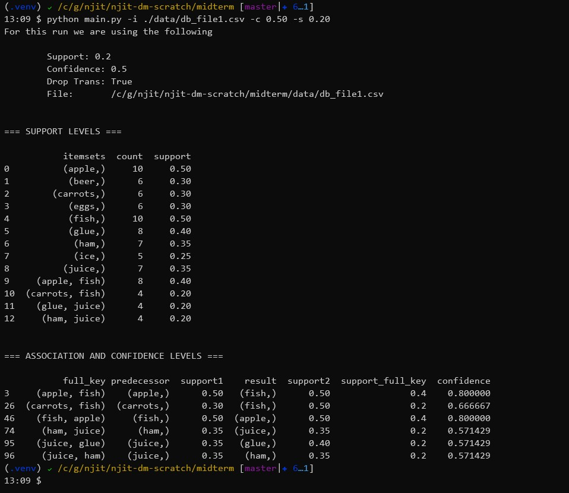
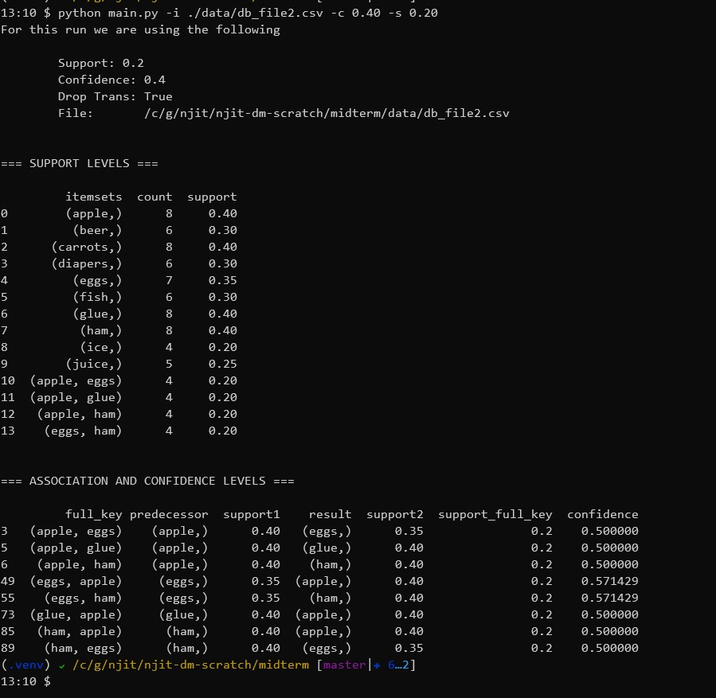
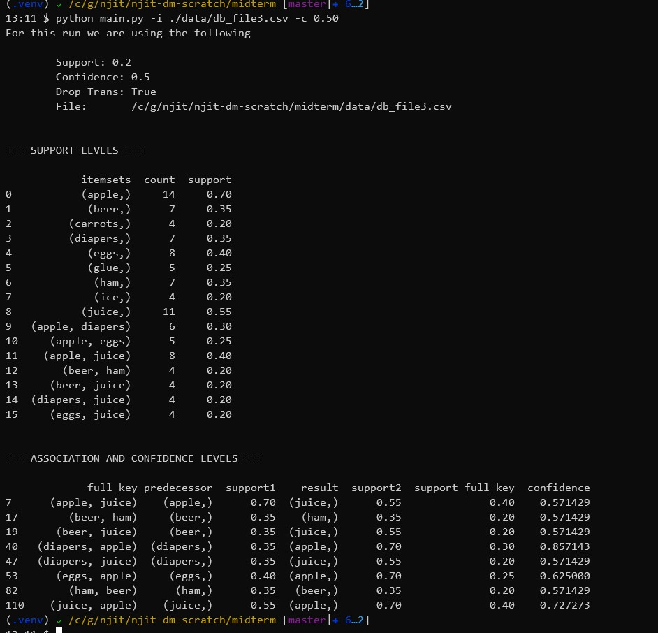
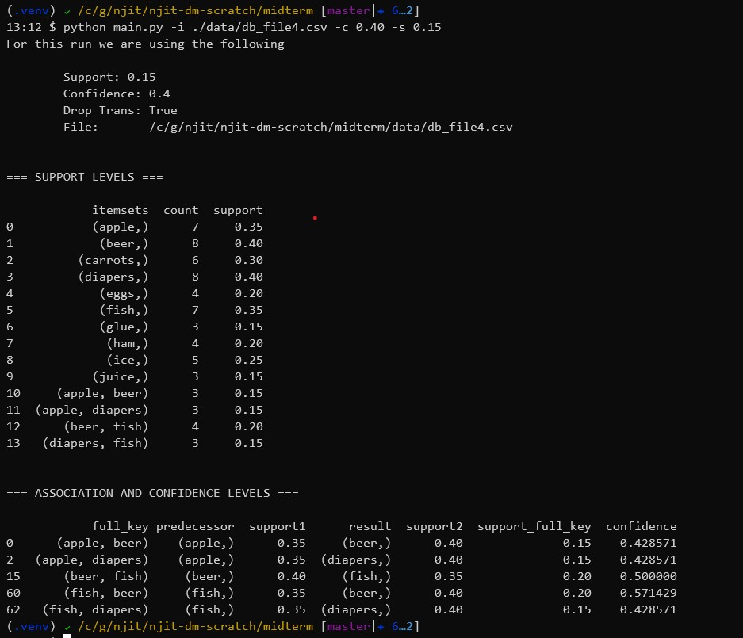
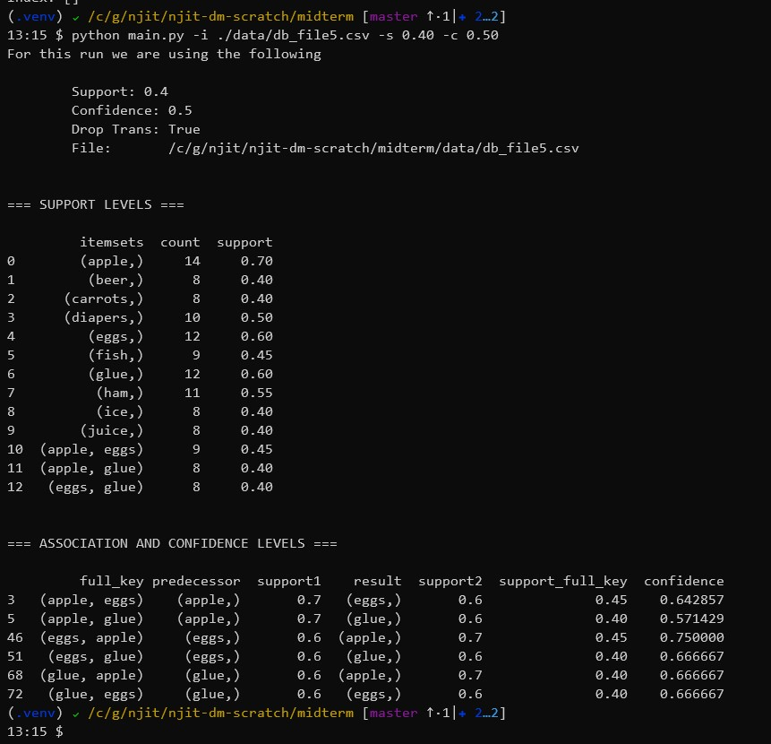

---
title: "Shawn Cicoria - CS 634 Data Mining Midterm Project"
author: "Shawn Cicoria"
date: "March 12 2020"
output:
  html_document:
    df_print: paged
email: sc2443@njit.edu
---
# Shawn Cicoria
# CS 634 Data Mining
# Midterm Project Report

## Date: March 12, 2020

<div style='page-break-after: always'></div>

<!-- Start Document Outline -->

* [Py_Apriori Module](#py_apriori-module)
	* [Requirements](#requirements)
	* [Setup](#setup)
		* [Setup your Python environment](#setup-your-python-environment)
			* [Create virtual env and activate](#create-virtual-env-and-activate)
		* [Unpack the tar file](#unpack-the-tar-file)
		* [Run setup](#run-setup)
	* [Running](#running)
		* [Options](#options)
		* [Sample run](#sample-run)
			* [Sample Run Output](#sample-run-output)
		* [Sample Run Data File](#sample-run-data-file)
	* [Data Format](#data-format)
* [Project Output](#project-output)
	* [Test DB 1](#test-db-1)
		* [DB File](#db-file)
		* [Output](#output)
	* [Test DB 2](#test-db-2)
		* [DB File](#db-file-1)
		* [Output](#output-1)
	* [Test DB 3](#test-db-3)
		* [DB File](#db-file-2)
		* [Output](#output-2)
	* [Test DB 4](#test-db-4)
		* [DB File](#db-file-3)
		* [Output](#output-3)
	* [Test DB 5](#test-db-5)
		* [DB File](#db-file-4)
		* [Output](#output-4)
* [Program Files](#program-files)
	* [main.py](#mainpy)
	* [py_apriori/apriori.py](#py_aprioriaprioripy)
	* [py_apriori/assoc.py](#py_aprioriassocpy)
	* [requirements.txt](#requirementstxt)
	* [setup.cfg](#setupcfg)
	* [Tools](#tools)
		* [gen.py](#genpy)
* [References:](#references)

<!-- End Document Outline -->

<div style='page-break-after: always'></div>

# Py_Apriori Module
This is a basic implementation in Python of the Apriori Association Algorithm

## Requirements

* Linux / Ubuntu 16+
* Python 3.6

## Setup
First download the `TAR` file to a location that you will use. I recommend a scratch directory that you can remove all when done.

In the text below, my extracted directory is: `/c/temp/py-apriori-0.1.0`

### Setup your Python environment
General recommendation is to use a Python Virtual Environment. With Python `3.5+` execute the following:


#### Create virtual `env` and activate
```
# from /c/temp/
python -m venv env  # this creates directory env
. ./env/bin/activate

```

### Unpack the `tar` file

From the directory where the virtual `env` and the `tar` file is:

```
# from /c/temp/
tar -xvf py-apriori-0.1.0.tar.gz
cd py-apriori-0.1.0.tar.gz

```

### Run setup

Once you've extracted the `tar` file, and changed to the `tar` output directory, now run `setup.py install` under python to add all dependencies

```
# from /c/temp/py-apriori-0.1.0

python setup.py install

```

At this point the program is ready to run, and a Test data file is present in `./data/`

## Running

The program makes use of argument parsing and all arguments can be seen by running the following:

```
# from /c/temp/py-apriori-0.1.0

python main.py -h

# ---
usage: main.py [-h] -i FILE [-c CONFIDENCE_LEVEL] [-s SUPPORT_LEVEL] [-n]
               [-o FILE]

implementation of the Apriori Algorithm

optional arguments:
  -h, --help            show this help message and exit
  -i FILE, --input FILE
                        input transaction file collapsed CSV format
  -c CONFIDENCE_LEVEL, --confidence CONFIDENCE_LEVEL
                        confidence level for association generation see https://en.wikipedia.org/wiki/Association_rule_learning#Confidence
  -s SUPPORT_LEVEL, --support SUPPORT_LEVEL
                        support level for support generation see https://en.wikipedia.org/wiki/Association_rule_learning#Support
  -n, --no-drop         DO NOT drop transactions below support level
  -o FILE, --output FILE
                        output file
```

### Options

| option                   | description                                                                                             | required | default                                                                                                                           |
|--------------------------|---------------------------------------------------------------------------------------------------------|----------|-----------------------------------------------------------------------------------------------------------------------------------|
| -i or --input            | specifies the input file that MUST be in CollapsedCSV format - see file format section below.           | YES      | na                                                                                                                                |
| -c or --confidence_level | sets the filtering criteria for associations that fall below the specified level.                       | NO       | 0.80                                                                                                                              |
| -s or --support_level    | sets the filtering criteria for support levels in the transactions that fall below the specified level. | NO       | 0.20                                                                                                                              |
| -n or --no-drop          | indicate IF you want to included items that fall below the support level in support generation          | NO       | - if this flag is present then ALL transactions at ALL support levels filter through to the confidence and association generation |


### Sample run

The extracted TAR file has a sample input file in `./data` -- to run:

```
# from /c/temp/py-apriori-0.1.0
python main.py -i data/data.csv
```
<div style='page-break-after: always'></div>

#### Sample Run Output

```
cicorias@cicoria-msi:/c/temp/py-apriori-0.1.0$ python main.py -i data/data.csv
For this run we are using the following

        Support: 0.2
        Confidence: 0.8
        Drop Trans: True
        File:       /c/temp/py-apriori-0.1.0/data/data.csv


=== SUPPORT LEVELS ===

        itemsets  count   support
0          (I1,)      6  0.666667
1          (I2,)      7  0.777778
2          (I3,)      6  0.666667
3          (I4,)      2  0.222222
4          (I5,)      2  0.222222
5       (I1, I2)      4  0.444444
6       (I1, I3)      4  0.444444
7       (I1, I5)      2  0.222222
8       (I2, I3)      4  0.444444
9       (I2, I4)      2  0.222222
10      (I2, I5)      2  0.222222
11  (I1, I2, I3)      2  0.222222
12  (I1, I2, I5)      2  0.222222


=== ASSOCIATION AND CONFIDENCE LEVELS ===

        full_key predecessor  support1    result  support2  support_full_key  confidence
23      (I4, I2)       (I4,)  0.222222     (I2,)  0.777778          0.222222         1.0
33      (I5, I1)       (I5,)  0.222222     (I1,)  0.666667          0.222222         1.0
34      (I5, I2)       (I5,)  0.222222     (I2,)  0.777778          0.222222         1.0
37  (I5, I1, I2)       (I5,)  0.222222  (I1, I2)  0.444444          0.222222         1.0
50  (I1, I5, I2)    (I1, I5)  0.222222     (I2,)  0.777778          0.222222         1.0
64  (I2, I5, I1)    (I2, I5)  0.222222     (I1,)  0.666667          0.222222         1.0

```
<div style='page-break-after: always'></div>

### Sample Run Data File

```csv
I1, I2, I5
I2, I4
I2, I3
I1, I2, I4
I1, I3
I2, I3
I1, I3
I1, I2, I3, I5
I1, I2, I3

```
## Data Format

The data file is in a simple format that I call **Collapsed CSV** as each line has multiple transaction items separated by a comma. So, it's not exactly a CSV file, but close.
<div style='page-break-after: always'></div>

# Project Output
The following are the test DB and the generated console output from the program.
## Test DB 1
### DB File
```
diapers,eggs,fish,
apple,fish,glue,ham,juice,
apple,beer,carrots,diapers,fish,
eggs,ham,ice,
carrots,glue,ham,
apple,fish,juice,
glue,ham,juice,
beer,eggs,ice,
carrots,fish,ice,
beer,glue,juice,
apple,fish,glue,
beer,ham,juice,
apple,carrots,fish,ham,juice,
apple,fish,ice,
apple,eggs,glue,
apple,diapers,eggs,
beer,carrots,glue,
apple,carrots,eggs,fish,ham,
apple,beer,fish,
glue,ice,juice,

```
### Output

<div style='page-break-after: always'></div>

## Test DB 2
### DB File
```
beer,carrots,glue,
beer,ham,juice,
beer,carrots,glue,
diapers,fish,juice,
carrots,eggs,ham,
carrots,fish,glue,
diapers,fish,ice,
diapers,ham,juice,
beer,carrots,ice,
apple,diapers,eggs,glue,ice,
apple,beer,eggs,glue,ham,
apple,beer,ham,
carrots,eggs,ham,
carrots,eggs,fish,
apple,glue,juice,
apple,carrots,diapers,
apple,eggs,glue,
fish,glue,juice,
apple,diapers,eggs,ham,ice,
apple,fish,ham,

```
### Output

<div style='page-break-after: always'></div>

## Test DB 3
### DB File
```
beer,ham,juice,
apple,diapers,eggs,ice,
apple,diapers,juice,
beer,carrots,ham,
apple,beer,juice,
apple,carrots,diapers,juice,
beer,eggs,glue,ham,
apple,carrots,ice,juice,
apple,diapers,eggs,glue,
apple,diapers,juice,
apple,glue,ham,
apple,beer,eggs,juice,
beer,glue,ham,
apple,eggs,juice,
apple,diapers,glue,
apple,carrots,eggs,ham,
diapers,eggs,juice,
apple,ham,ice,
eggs,ice,juice,
apple,beer,juice,

```
### Output

<div style='page-break-after: always'></div>

## Test DB 4
### DB File
```
eggs,glue,
apple,eggs,ham,
apple,glue,
beer,fish,
carrots,diapers,
apple,diapers,ice,
carrots,diapers,eggs,
apple,diapers,fish,
diapers,ice,
carrots,ice,
beer,diapers,fish,
apple,beer,diapers,fish,juice,
beer,eggs,juice,
apple,beer,ice,
carrots,fish,juice,
beer,carrots,ham,
apple,beer,carrots,
fish,ice,
beer,fish,ham,
diapers,glue,ham,

```
### Output

<div style='page-break-after: always'></div>

## Test DB 5
### DB File
```
apple,carrots,eggs,glue,juice,
apple,beer,diapers,ice,juice,
beer,carrots,diapers,glue,ham,
apple,carrots,fish,glue,ice,
apple,beer,ham,ice,juice,
apple,eggs,fish,glue,ham,
apple,eggs,fish,glue,juice,
apple,diapers,fish,ham,ice,
apple,diapers,eggs,glue,ham,
apple,carrots,eggs,fish,ice,
carrots,diapers,eggs,ham,ice,
beer,carrots,eggs,fish,glue,
apple,diapers,eggs,fish,ham,
beer,diapers,eggs,glue,juice,
apple,diapers,eggs,glue,ice,
apple,beer,carrots,glue,ham,
apple,diapers,eggs,glue,ice,
beer,diapers,glue,ham,juice,
beer,carrots,fish,ham,juice,
apple,eggs,fish,ham,juice,

```
### Output

<div style='page-break-after: always'></div>

# Program Files
## main.py
```python
import os
import sys
import argparse
import logging

from py_apriori.apriori import Apriori, CollapsedCsvFileReader
from py_apriori.assoc import (calculate_confidence,
                              create_associations)

logging.basicConfig()
logger = logging.getLogger('apriori')
logger.setLevel(logging.WARN)


class Program:
    def __init__(self):
        self.data = []

    def parse_arguments(self):
        parser = argparse.ArgumentParser(description='implementation of the Apriori Algorithm',
                                         formatter_class=argparse.RawTextHelpFormatter)
        parser.add_argument('-i', '--input', dest='FILE', required=True,
                            help='input transaction file collapsed CSV format', metavar='FILE',
                            type=lambda x: self.is_valid_file(parser, x))
        parser.add_argument('-c', '--confidence', dest='confidence_level', required=False,
                            default=0.80,
                            type=float,
                            help='confidence level for association generation see https://en.wikipedia.org/wiki/Association_rule_learning#Confidence')
        parser.add_argument('-s', '--support', dest='support_level', required=False,
                            default=0.20,
                            type=float,
                            help='support level for support generation see https://en.wikipedia.org/wiki/Association_rule_learning#Support')
        parser.add_argument('-n', '--no-drop', dest='drop_below_support_level', required=False,
                            default=True, action='store_false',
                            help='DO NOT drop transactions below support level')

        parser.add_argument("-o", "--output", dest="output",
                            type=argparse.FileType('w'),
                            metavar="FILE",
                            default=sys.stdout,
                            help="output file")

        self.args = parser.parse_args()

    def is_valid_file(self, parser, arg):
        if not os.path.exists(arg):
            parser.error("The file %s does not exist!" % arg)
        else:
            return os.path.abspath(arg)

    @property
    def FILE(self):
        return self.args.FILE

    def print(self, content):
        print(content, file=self.args.output)


def main():
    prog = Program()
    prog.parse_arguments()

    file_reader = CollapsedCsvFileReader(prog.FILE)
    raw_transactions = file_reader.read()

    apriori_instance = Apriori(raw_transactions)

    # setup for output
    support = prog.args.support_level
    confidence = prog.args.confidence_level
    drop_trans = prog.args.drop_below_support_level

    prog.print("For this run we are using the following\n")
    prog.print("\tSupport: {}".format(support))
    prog.print("\tConfidence: {}".format(confidence))
    prog.print("\tDrop Trans: {}".format(drop_trans))
    prog.print("\tFile:       {}".format(prog.FILE))

    # just generate the levels and filter as needed
    support_level_output = apriori_instance.generate_levels(support_level=support, drop_below_support=drop_trans)
    prog.print("\n\n=== SUPPORT LEVELS ===\n")
    prog.print(support_level_output)

    # create the associations
    # TODO: mabye encapsulate this step.
    associated_transactions = create_associations(support_level_output)

    # generate the confidence levels.
    confidence_report = calculate_confidence(associated_transactions, confidence_level=confidence)

    prog.print("\n\n=== ASSOCIATION AND CONFIDENCE LEVELS ===\n")
    prog.print(confidence_report)

    # prog.print(len(confidence_report))


if __name__ == "__main__":
    main()

```
<div style='page-break-after: always'></div>

## py_apriori/apriori.py
```python
from typing import List, Tuple
from itertools import combinations
from abc import ABC, abstractmethod
import pandas as pd
import logging

logging.basicConfig()
logger = logging.getLogger("apriori")


class Apriori(object):
    # following https://en.wikipedia.org/wiki/Apriori_algorithm#Examples
    def __init__(self, transactions: List):
        self.__verify__(transactions)

        self._transactions = transactions

    def __str__(self):
        return str(tuple(self))

    def __verify__(self, transactions):
        if transactions is None:
            raise ValueError("Transaction itemset is none")

        if not isinstance(transactions, List):
            raise ValueError("Transaction itemset is not a List")

        if len(transactions) == 0:
            raise ValueError("Transaction is empty")

        if len(transactions) > 0 and not isinstance(transactions[0], Tuple):
            raise ValueError("Transaction lement is not a Tuple")

    @property
    def transactions(self) -> List:
        return self._transactions

    @transactions.setter
    def transactions(self, value: List):

        self.__verify__(value)
        self._transactions = value

    def generate_levels(self, support_level: float = 0.20, drop_below_support: bool = True) -> pd.DataFrame:
        k = 1
        full_set = list()  # this contains a dataframe for each level.
        while True:
            logger.info("k = {0}".format(k))
            item_levels = self.__generate_combinination_levels(self._transactions, k)
            sl = self.__gen_support_level(self._transactions, item_levels,
                                          support=support_level, drop=drop_below_support)

            # logger.debug("transactions at level {k} are {n}".format(k = k, n = (len(sl))))
            k += 1

            if len(sl) == 0 or k == 100:
                break

            df = pd.DataFrame.from_dict(sl, orient='index', columns=['count'])
            df.index.name = 'itemsets'
            df.reset_index()
            full_set.append(df)

        rv = self.__append_colums(full_set)
        return rv

    def __append_colums(self, data: List, tran_list=None) -> pd.DataFrame:
        if tran_list is None:
            tran_list = self.transactions

        tran_count = len(tran_list)

        rows_list = []
        for r in data:
            # logger.debug('type of r is: {0}'.format(type(r)))
            # logger.debug('len of r is: {0}'.format(len(r)))
            # logger.debug('r is: {0}'.format(r))
            for index, row in r.iterrows():
                # d = { 'count' : r['count'], 'support': r['count']/tran_count}
                d = {'itemsets': index, 'count': row['count'], 'support': row['count']/tran_count}
                # logger.debug("THE DICTd: {0}".format(d))
                rows_list.append(d)

        df = pd.DataFrame(rows_list)

        return df

    def __generate_combinination_levels(self, tran_list, level):
        """generate keys that are used for subset checking"""
        """on each transaction"""
        results = list()
        for t in tran_list:
            logger.debug("gen_com_levell: t: {0}  and level: {1}".format(t, level))
            [results.append(i) for i in combinations(t, level)]

        rv = sorted(set(results))
        logger.debug("combo levels: {0}".format(rv))
        return rv

    def __gen_support_level(self, tran_list, items_keys, support=0.20, drop=True):
        """for each key which can be a set find in transactions"""
        """how many contain the combination"""
        logger.info('Using support level of {0}'.format(support))
        logger.info('drop below support? {0}'.format(drop))
        tran_count = len(tran_list)
        base_level = tran_count * support
        logger.debug('base level count: {0}'.format(base_level))
        itemSet = dict()

        for key in items_keys:
            for t in tran_list:
                if set(key).issubset(t):
                    # logger.debug('is subset: {0}'.format(t))
                    if (key) in itemSet:
                        itemSet[key] += 1
                    else:
                        itemSet[key] = 1

        if drop:
            return {key: value for (key, value) in itemSet.items() if value >= base_level}
        else:
            return {key: value for (key, value) in itemSet.items()}


class FileReader(ABC):
    def __init__(self, file_path):
        self.file_path = file_path

    @abstractmethod
    def read(self) -> list:
        pass


class CollapsedCsvFileReader(FileReader):
    """the file format is lines, with individual transactinos"""
    """separated by commma - thus calling this collapsed"""
    """file format as it is non-traditional"""

    def read(self) -> list:
        file_iter = open(self.file_path, 'r')
        raw_transactions = list()
        for line in file_iter:
            line = line.strip().rstrip(',')
            # remove whitespace around items
            trimmed = [i.strip() for i in line.split(',')]
            record = tuple(sorted(trimmed))
            raw_transactions.append(record)

        return raw_transactions

```
<div style='page-break-after: always'></div>

## py_apriori/assoc.py
```python
from typing import Tuple
from collections import namedtuple

import pandas as pd
import logging

logging.basicConfig()
logger = logging.getLogger("apriori")


assocation_record = namedtuple('assocation_record', ['full_key', 'predecessor',
                                                     'support1', 'result', 'support2', 'support_full_key', 'confidence'])


def create_associations(data: pd.DataFrame) -> pd.DataFrame:
    n2 = generate_associations(data)
    pc = generate_combo_itemsets(n2)
    return pc


def generate_associations(data: pd.DataFrame) -> pd.DataFrame:
    rv = list()
    # TODO: refactor itertuples
    for r in data.iterrows():
        # current row ID
        idx = r[0]
        item = data.iloc[idx]['itemsets']
        # all_other is everything BUT the current key.
        all_other = [k for k, v in data.iterrows() if k != idx]
        # THIS current item support.
        support = data.iloc[idx]['support']

        temp = [(item, support, data.iloc[y]['itemsets'], data.iloc[y]['support'])
                for y in all_other
                if not set(item).issubset(data.iloc[y]['itemsets'])]

        rv.extend(temp)

    return pd.DataFrame(rv, columns=['predecessor', 'support1', 'result', 'support2'])


def generate_combo_itemsets(data: pd.DataFrame) -> pd.DataFrame:
    possible_combos = [(i[1]['predecessor'] + i[1]['result'],
                        i[1]['predecessor'], i[1]['support1'], i[1]['result'], i[1]['support2'])
                       # TODO: refactor itertuples
                       for i in data.iterrows()
                       # elimiate where item on boths sides
                       if not bool(set(i[1]['result']) & set(i[1]['predecessor']))]

    return pd.DataFrame(possible_combos, columns=['fullkey', 'predecessor', 'support1', 'result', 'support2'])


def get_support_for_key(data: pd.DataFrame, predecessor_key: Tuple) -> float:
    rv = 0
    srted_key = tuple(sorted(predecessor_key))
    matches = data[data['predecessor'] == srted_key].head(1)
    if len(matches) == 1:
        rv = matches['support1'].array[0]

    return rv


def calculate_confidence(data: pd.DataFrame, confidence_level: float = 0.0) -> pd.DataFrame:
    rv = list()
    for r in data.itertuples():
        full_key = r.fullkey
        ant = r.predecessor
        support1 = r.support1
        res = r.result
        support2 = r.support2
        support_full_key = get_support_for_key(data, full_key)
        if support1 != 0:
            confidence = support_full_key / support1
        else:
            confidence = -1

        item_rv = assocation_record(
            full_key, ant, support1, res, support2, support_full_key, confidence)

        rv.append(item_rv)

    rv_df = pd.DataFrame(rv)
    return rv_df[rv_df.confidence > confidence_level]

```
<div style='page-break-after: always'></div>

## requirements.txt
```
poetry==1.0.2
pandas==1.0.1

```
## setup.cfg
```
[flake8]
max-line-length = 160

```
<div style='page-break-after: always'></div>

## Tools
### gen.py
```python
from itertools import combinations
import random


def read(file_path) -> list:
    file_iter = open(file_path, 'r')
    items = list()
    for line in file_iter:
        line = line.strip()
        items.append(line)

    return items


def get_random_count():
    return random.randint(2, 5)


def generate_itemset(input_file):
    rv = list()
    out_list = list()
    for r in range(0, 20):
        item_permutations = [out_list.append(i) for i in combinations(input_file, get_random_count())]
        total_permutations = len(item_permutations)
        ic = random.randint(0, total_permutations)
        item_set = out_list[ic]
        rv.append(sorted(item_set))

    return rv


def generate_db_file(input_file, output_file):
    file1 = generate_itemset(input_file)
    with open(output_file, "w") as outfile:
        all_buffer = ""
        for item in file1:
            buffer = ""
            for i in item:
                buffer += i + ","

            buffer.strip().rstrip(',')
            all_buffer += buffer + '\n'

        outfile.writelines(all_buffer)


random.seed(2020)
input_file = read('./data/item.csv')

generate_db_file(input_file, './data/db_file1.csv')
generate_db_file(input_file, './data/db_file2.csv')
generate_db_file(input_file, './data/db_file3.csv')
generate_db_file(input_file, './data/db_file4.csv')
generate_db_file(input_file, './data/db_file5.csv')
```

<div style='page-break-after: always'></div>

# References:
This is a basic implementation of the Apriori Algorithm[1]

> [Google Scholar](https://scholar.google.com/scholar?q=R.C.%20Agarwal%2C%20C.C.%20Aggarwal%2C%20and%20V.V.V.%20Prasad.%20Depth%20first%20generation%20of%20long%20patterns.%20In%20Proc.%20of%20the%206th%20ACM%20SIGKDD%20Int.%20Conf.%20on%20Knowledge%20Discovery%20and%20Data%20Mining%2C%20pages%20108%E2%80%93118%2C%20Boston%2C%20MA%2C%20USA%2C%202000.) - Agrawal, Rakesh, Tomasz Imieliński, and Arun Swami. "Mining association rules between sets of items in large databases." Proceedings of the 1993 ACM SIGMOD international conference on Management of data. 1993.


